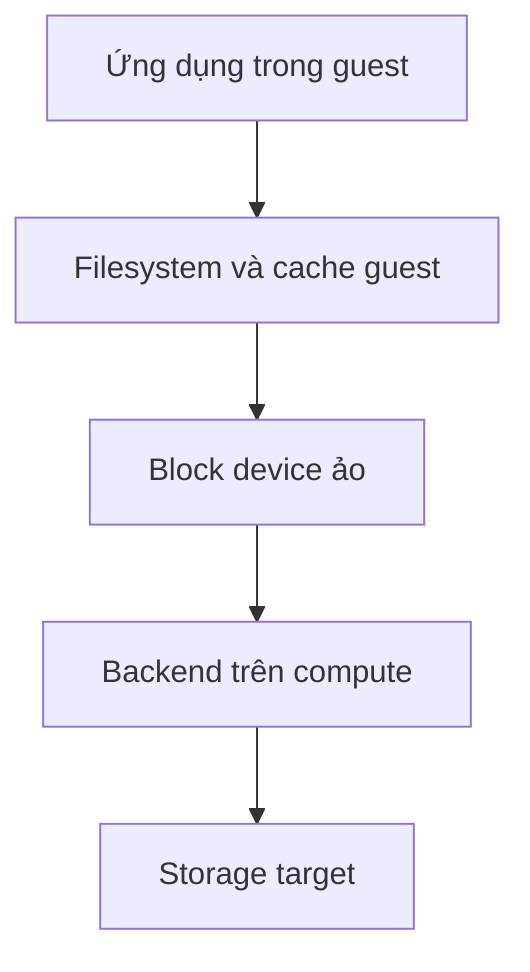

Để hiểu được các giải pháp tối ưu phức tạp như SPDK hay NVMe-oF, ta cần đi theo đúng dòng chảy tự nhiên của dữ liệu: **từ góc nhìn của ứng dụng (phần mềm) $\rightarrow$ cách dữ liệu được vận chuyển (hành vi I/O) $\rightarrow$ cách đo lường hiệu quả (chỉ số hiệu năng) $\rightarrow$ áp dụng vào bài toán máy ảo (VM) thực tế.**
## Mục lục
1. Bảng thuật ngữ
2. Nội dung kiến thức và kết quả cần đạt
3. File, filesystem và block device
4. Một yêu cầu read/write diễn ra thế nào
5. Cache và ý nghĩa của “ghi xong”
6. Workload I/O gồm những đặc điểm gì
7. IOPS, throughput, latency và queue depth
8. Liên hệ với VM trong dự án
9. Tổng kết 

## Bảng thuật ngữ

|Thuật ngữ|Hiểu ngắn gọn|
|---|---|
|**File**|Dữ liệu có tên mà ứng dụng thường mở để đọc hoặc ghi.|
|**Filesystem**|Lớp tổ chức file, thư mục và xác định dữ liệu của file nằm ở đâu.|
|**Block device**|Thiết bị cho phép đọc/ghi theo vị trí logic, chẳng hạn `/dev/vdb` trong guest.|
|**Partition**|Một vùng được chia ra từ block device, chẳng hạn `/dev/vdb1`.|
|**LBA**|Địa chỉ của một khối logic trên block device.|
|**Page cache**|Vùng RAM được Linux dùng để giữ dữ liệu file đã đọc hoặc đang chờ ghi.|
|**Durability**|Mức bảo đảm dữ liệu còn tồn tại sau một loại sự cố xác định.|
|**IOPS**|Số yêu cầu I/O hoàn thành mỗi giây.|
|**Throughput**|Lượng dữ liệu hoàn thành mỗi giây, thường tính bằng MiB/s.|
|**Latency**|Thời gian hoàn thành một yêu cầu I/O tại điểm đang đo.|
|**Queue depth (QD)**|Số I/O đã gửi đi nhưng chưa hoàn thành tại một điểm trong hệ thống.|

## Nội dung kiến thức và kết quả cần đạt


- Vì sao file khác filesystem và block device.
    
- Vì sao một lần `read()` hoặc `write()` không nhất thiết tạo đúng một I/O tới storage.
    
- Vì sao `write()` trả về thành công chưa đủ để kết luận dữ liệu đã bền vững.
    
- Vì sao phải đọc IOPS cùng với kích thước I/O, latency và QD.
    
- Những điều có thể và không thể suy ra khi VM thấy `/dev/vdb`.
    

## 1. File, filesystem và block device

Hãy tưởng tượng một **nhà kho khổng lồ chứa hàng triệu hộc tủ giống hệt nhau**:

```
[Ứng dụng]          → Muốn: "Lưu bản hợp đồng tên là hopdong.pdf"
      ↓
[Filesystem]         → Người quản kho: Có cuốn sổ mục lục (Metadata).
                       Ghi chú: 'hopdong.pdf' nằm rải ở các hộc số #12, #13, #85.
      ↓
[Block Device]       → Dãy tủ vật lý gồm các hộc được đánh số thứ tự từ 0 đến N.
                       Không biết chữ, chỉ biết: "Mở hộc #12 bỏ vào 4KB này".
```

### Chi tiết từng lớp:

1. **File (Tệp tin):** Là khái niệm logic thân thiện với con người và ứng dụng. Một file có tên gọi (`report.txt`), có phần mở rộng, quyền hạn (ai được xem) và nội dung liền mạch.
    
2. **Block Device (Thiết bị khối):** Là phần cứng hoặc ổ đĩa logic (như `/dev/sda`, `/dev/vdb`).
    
    - Nó coi toàn bộ không gian lưu trữ là một mảng dài vô tận các ô chứa cố định gọi là **Sector** hoặc **Block** (thường là 512 bytes hoặc 4096 bytes / 4 KiB).
        
    - Mỗi ô được gắn một số thứ tự duy nhất gọi là **LBA (Logical Block Address)**: LBA 0, LBA 1, LBA 2...
        
    - **Đặc tính sống còn:** Block device hoàn toàn mù tịt về khái niệm "tên file" hay "thư mục". Nó chỉ hiểu hai lệnh cơ bản:
        
        - _Đọc $X$ byte tại LBA $Y$_.
            
        - _Ghi $X$ byte vào LBA $Y$_.
            
3. **Filesystem (Hệ thống tệp - ext4, xfs, NTFS):** Là cầu nối thông dịch giữa File và Block Device.
    
    - Quản lý **Metadata (Siêu dữ liệu):** Cuốn sổ mục lục lưu trữ Inode, danh mục thư mục, kích thước file, thời gian sửa đổi (`mtime`), và quan trọng nhất: **file này đang chiếm những LBA nào**.
        
    - Phân bổ không gian: Theo dõi xem LBA nào đang rảnh, LBA nào đã có dữ liệu.
        

> **Bản chất của `/dev/vdb` trong máy ảo (VM):**
> 
> Khi bạn gõ `lsblk` trong Guest OS và thấy `/dev/vdb`, đây chỉ là **ảo ảnh logic** do hệ điều hành tạo ra. `/dev/vdb` không cho bạn biết dữ liệu thực sự nằm trên một thanh NVMe cắm tại mainboard máy chủ, hay đang chạy qua cáp mạng quang tới tủ đĩa NetApp cách đó hàng cây số.


## 2. Một yêu cầu read/write diễn ra thế nào?

Khi ứng dụng bấm "Lưu" hoặc "Mở" file, dữ liệu không bay thẳng xuống đĩa cứng ngay lập tức.
### Thao tác ĐỌC (Read): Đua tốc độ với RAM

1. Ứng dụng yêu cầu đọc 4 KiB đầu tiên của file `report.txt`.
    
2. Filesystem tra sổ mục lục, biết 4 KiB này nằm ở LBA #5000.
    
3. **Kiểm tra Page Cache (RAM):** Linux kiểm tra xem LBA #5000 đã được nạp sẵn vào RAM từ trước chưa.
    
    - **Cache Hit (Trúng):** Dữ liệu có sẵn trên RAM $\rightarrow$ trả về cho ứng dụng trong vài nano-giây. Ổ cứng hoàn toàn "ngủ yên", không phát sinh bất kỳ I/O vật lý nào.
        
    - **Cache Miss (Trượt):** Dữ liệu chưa có trên RAM $\rightarrow$ CPU phải ra lệnh cho Block Device nạp dữ liệu từ LBA #5000 lên RAM, sau đó mới trả cho ứng dụng.
        

### Thao tác GHI (Write): 4 mốc thời gian dễ gây nhầm lẫn

Khi ứng dụng gọi lệnh `write()` để lưu dữ liệu, có một chuỗi thời điểm tách biệt:

```
[1. App gửi write()] 
        ↓
[2. write() trả về THÀNH CÔNG]  ← (Mới chỉ lưu vào RAM / Page Cache)
        ↓
[3. Dữ liệu rời RAM xuống đĩa]   ← (Kernel gom cụm rồi xả xuống hardware)
        ↓
[4. Dữ liệu thực sự BỀN VỮNG]    ← (Đã ghi chặt vào chip Flash / có nguồn pin bảo vệ)
```

- **Điểm bẫy:** Khi hàm `write()` báo thành công, **99% trường hợp dữ liệu mới chỉ nằm ở Page Cache trong RAM của Guest OS**. Nếu máy chủ bị cúp điện đột ngột ở giây tiếp theo, dữ liệu đó biến mất hoàn toàn!
    
- Một lệnh `write()` từ ứng dụng có thể sinh ra **nhiều I/O xuống đĩa** (vừa ghi nội dung, vừa ghi metadata cập nhật kích thước file), hoặc **không sinh ra I/O nào ngay lập tức** (do được gom lại trong RAM).

## 3. Cache và ý nghĩa của “ghi xong”

Trong đường đi của VM, cache có thể xuất hiện ở nhiều nơi. Chẳng hạn, **guest có page cache**, backend trên compute có cách xử lý riêng, và storage target có thể có cache của nó. Vì thế, nói “dữ liệu đã vào cache” vẫn còn thiếu: **cache ở lớp nào?**

Có ba khái niệm cần tách rõ:

|Khái niệm|Ý nghĩa|
|---|---|
|**Buffered I/O**|Linux có thể dùng page cache để phục vụ đọc hoặc nhận dữ liệu ghi.|
|**Direct I/O**|Thường tránh page cache tại phía tiến trình thực hiện I/O; không có nghĩa toàn hệ thống không còn cache.|
|**Sync/flush**|Yêu cầu đồng bộ dữ liệu theo ngữ nghĩa của giao diện đang dùng.|

Linux kernel mặc định coi RAM là bộ đệm đa năng để thu hẹp khoảng cách tốc độ giữa CPU và thiết bị lưu trữ. Toàn bộ hành vi ghi/đọc mặc định đều đi qua lớp trừu tượng này.

```
+-----------------------------------------------------------+
|             User Application (Buffer in User Space)       |
+-----------------------------------------------------------+
       |                                       |
  read / write                            read / write
 (Buffered I/O)                           (O_DIRECT)
       v                                       |
+----------------------+                       |
|   Page Cache (RAM)   |                       |
+----------------------+                       |
       | (pdflush / sync)                      |
       v                                       v
+-----------------------------------------------------------+
|                      Block Layer                          |
+-----------------------------------------------------------+
```

### Page Cache và Chu trình Dirty Page

- **Read Ahead (Đọc trước):** Khi ứng dụng đọc tuần tự, kernel tự động nạp trước các khối lân cận vào Page Cache (kích thước trang mặc định 4KiB) để giảm thiểu I/O vật lý.
    
- **Writeback Caching (Ghi trễ):** Lệnh `write()` mặc định hoàn tất ngay khi dữ liệu được copy từ bộ đệm người dùng vào Page Cache. Lúc này dữ liệu được đánh dấu là **Dirty (bẩn)**.
    
- **Tiêu chí xả đĩa (Flush):** Kernel (tiến trình `kworker/flush`) đẩy dirty pages xuống đĩa theo các tham số kernel:
    
    - `vm.dirty_background_ratio`: Tỷ lệ % RAM bị dirty mà tại đó kernel bắt đầu âm thầm ghi ngầm xuống đĩa.
        
    - `vm.dirty_ratio`: Ngưỡng % RAM dirty tối đa; nếu vượt qua, các tiến trình gọi lệnh `write()` sẽ bị chặn (block) để trực tiếp ép xả đĩa, gây hiện tượng spike latency nghiêm trọng.
        

### Kiểm soát tính toàn vẹn (Data Persistence)

Để đảm bảo dữ liệu ghi xuống đĩa không bị mất khi mất điện đột ngột, ứng dụng sử dụng các cơ chế:

|**Cơ chế / Cờ**|**Hành vi kỹ thuật**|**Chi phí hiệu năng (Overhead)**|
|---|---|---|
|**`fsync(fd)`**|Ép xả toàn bộ Dirty Pages của file kèm **toàn bộ Metadata** (kích thước, mtime, inode flags) xuống đĩa vật lý.|Rất cao; gây block luồng gọi cho đến khi thiết bị phản hồi lệnh Flush.|
|**`fdatasync(fd)`**|Chỉ ép xả dữ liệu tệp và Metadata **bắt buộc** để đọc lại dữ liệu (ví dụ: file size). Bỏ qua việc cập nhật `atime`, `mtime`.|Thấp hơn `fsync`, thường dùng trong database engine (WAL).|
|**`O_SYNC`**|Mọi lệnh `write()` đều tự động kích hoạt ngữ nghĩa tương đương `fsync` trước khi trả về User Space.|Rất cao; triệt tiêu hoàn toàn khả năng gom cụm I/O của kernel.|
|**`O_DIRECT`**|**Bypass hoàn toàn Page Cache.** Dữ liệu copy thẳng từ User Space buffer xuống thiết bị qua DMA (Direct Memory Access).|Giảm tải CPU và RAM, nhưng đòi hỏi memory buffer, file offset và transfer size phải **căn chỉnh theo block size (512B hoặc 4KiB)**.|

> **Điểm bẫy trong ảo hóa (Double Caching Trap):** Nếu Host OS không bật `O_DIRECT` cho disk image của VM, dữ liệu sẽ bị cache 2 lần: 1 lần tại Page Cache của Guest OS và 1 lần tại Page Cache của Host OS. Điều này gây lãng phí RAM nghiêm trọng và suy giảm hiệu năng. Đây là lý do QEMU và SPDK luôn ép buộc dùng cơ chế Direct I/O / Shared Memory.
### Phân biệt 3 cơ chế điều khiển I/O

|**Cơ chế**|**Cách hoạt động**|**Được gì? Mất gì?**|**Ứng dụng thực tế**|
|---|---|---|---|
|**Buffered I/O** _(Mặc định)_|Ứng dụng đọc/ghi qua **Page Cache (RAM)**. Linux tự quyết định khi nào rảnh thì mới ghi xuống đĩa thật (Write-back).|**Được:** Ứng dụng chạy cực nhanh, latency thấp.<br><br>  <br><br>**Mất:** Nguy cơ mất dữ liệu khi crash; tốn CPU copy dữ liệu giữa RAM ứng dụng và RAM kernel.|Ứng dụng văn phòng, copy file thông thường, web server đọc file tĩnh.|
|**Direct I/O** (`O_DIRECT`)|**Bỏ qua Page Cache.** Dữ liệu copy thẳng từ bộ nhớ ứng dụng xuống thiết bị lưu trữ bằng cơ chế DMA.|**Được:** Tiết kiệm CPU/RAM; không làm bẩn RAM hệ thống.<br><br>  <br><br>**Mất:** Tốc độ phụ thuộc hoàn toàn vào phần cứng đĩa; dữ liệu và buffer phải căn chỉnh kích thước (thường là bội số 4 KiB).|Database Engine (MySQL, PostgreSQL), phần mềm ảo hóa (QEMU, SPDK).|
|**Sync / Flush** (`fsync`)|Một lệnh cưỡng chế: _"Hãy dừng lại, đem toàn bộ dữ liệu đang nằm trên RAM ghi hết xuống đĩa vật lý, xong xuôi mới được trả về!"_|**Được:** Đảm bảo tính bền vững tuyệt đối (Durability).<br><br>  <br><br>**Mất:** Rất chậm; gây khựng ứng dụng (I/O stall).|Giao dịch ngân hàng, commit transaction của cơ sở dữ liệu (WAL log).|

> **Cảnh báo sai lầm:** `O_DIRECT` **không tương đương** với `fsync`. Direct I/O chỉ bỏ qua cache của hệ điều hành, nhưng controller của ổ đĩa hoặc storage target vẫn có thể có bộ đệm riêng của nó. Muốn chắc chắn dữ liệu không mất khi mất điện, ứng dụng vẫn cần lệnh đồng bộ (Flush).
## 4. Workload I/O gồm những đặc điểm gì?

**Workload** là kiểu yêu cầu I/O mà ứng dụng tạo ra. Không có một con số “hiệu năng storage” đại diện cho mọi workload.

|Đặc điểm|Ví dụ|Vì sao quan trọng?|
|---|---|---|
|**Kích thước mỗi I/O**|4 KiB hoặc 1 MiB|I/O nhỏ cần nhiều thao tác hơn để chuyển cùng lượng dữ liệu.|
|**Read/write mix**|Toàn đọc; hoặc 70% đọc, 30% ghi|Đọc và ghi có hành vi khác nhau.|
|**Tuần tự/ngẫu nhiên**|Đọc các vùng liền nhau hoặc ở nhiều vị trí|Ảnh hưởng cách các lớp xử lý yêu cầu.|
|**Working set**|Dữ liệu vài MiB hoặc vài TiB|Tập nhỏ có thể nằm trong cache; tập lớn có thể không.|
|**Mức song song**|Một hoặc nhiều I/O cùng chờ hoàn thành|Ảnh hưởng IOPS và thời gian chờ.|
|**Yêu cầu durability**|Ghi có đệm hoặc cần đồng bộ|Thay đổi điều kiện để một write được coi là hoàn thành.|
Không tồn tại một con số chung gọi là "tốc độ của đĩa". Tốc độ nhanh hay chậm phụ thuộc hoàn toàn vào bạn đang "bắt nó làm việc gì" (Workload):

1. **Kích thước I/O (I/O Block Size):**
    
    - _Nhỏ (4 KiB - 8 KiB):_ Điển hình của Database, đọc/ghi các bản ghi ngẫu nhiên.
        
    - _Lớn (128 KiB - 1 MiB):_ Điển hình của việc xem video 4K, sao lưu dữ liệu, streaming.
        
2. **Tuần tự (Sequential) vs Ngẫu nhiên (Random):**
    
    - _Tuần tự:_ Đọc ghi các khối LBA nằm sát nhau liên tiếp (LBA 1, 2, 3...). Đĩa xử lý rất mượt vì không phải đổi vùng tìm kiếm.
        
    - _Ngẫu nhiên:_ Đọc LBA 5, nhảy sang LBA 99999, nhảy về LBA 50. Kể cả SSD NVMe cũng bị giảm hiệu năng khi ghi ngẫu nhiên so với tuần tự.
        
3. **Tỷ lệ Đọc/Ghi (Read/Write Mix):** Đọc 100%, Ghi 100%, hay hỗn hợp (70% Read / 30% Write).
    
4. **Mức độ song song:** Có bao nhiêu luồng/tiến trình đang cùng đè I/O vào hệ thống một lúc.
Chẳng hạn, ứng dụng ghi tuần tự những yêu cầu 1 MiB và cơ sở dữ liệu ghi ngẫu nhiên những yêu cầu 4 KiB sẽ đặt áp lực rất khác lên cùng một volume.

## 5. Bộ chỉ số:  IOPS, throughput, latency và queue depth

Đây là 4 chỉ số bạn bắt buộc phải đọc cùng lúc, không bao giờ được tách rời.

### 1. IOPS & Throughput (Thông lượng):

- **IOPS (Input/Output Operations Per Second):** Số lần hoàn thành thao tác đọc/ghi trong 1 giây.
    
- **Throughput (Băng thông):** Khối lượng dữ liệu thực tế đẩy qua đường truyền trong 1 giây.
    

Mối liên hệ toán học:

$$\text{Throughput (Băng thông)} \approx \text{IOPS} \times \text{Kích thước mỗi I/O (Block Size)}$$

**Ví dụ trực quan:**

- **Kịch bản A:** Xe máy chở từng kiện hàng 4 KiB, chạy điên cuồng đạt **10.000 chuyến/giây (10.000 IOPS)**.
    
    $$\text{Throughput} = 10.000 \times 4\text{ KiB} \approx \mathbf{39\text{ MiB/s}}$$
    
- **Kịch bản B:** Xe tải chở kiện hàng 64 KiB, cũng chạy được **10.000 chuyến/giây (10.000 IOPS)**.
    
    $$\text{Throughput} = 10.000 \times 64\text{ KiB} \approx \mathbf{625\text{ MiB/s}}$$
    

> Nếu ai đó nói: _"Storage của tôi đạt 100.000 IOPS!"_, câu hỏi đầu tiên bạn phải hỏi lại ngay: **"Ở kích thước I/O bao nhiêu? 4 KiB hay 512 bytes? Random hay Sequential?"**

### 2. Latency (Tail Latency)

- **Latency (Độ trễ):** Thời gian tính từ khi một yêu cầu I/O được phát đi cho đến khi nhận được thông báo "Đã xong".
    
- **Vì sao Average Latency (Trung bình) là vô nghĩa?**
    
    - Giả sử bạn gửi 100 gói dữ liệu. 99 gói hoàn thành trong **0.1 ms**, nhưng đúng 1 gói gặp sự cố mất **1000 ms (1 giây)**.
        
    - Độ trễ trung bình tính ra vẫn rất đẹp: $\approx 10\text{ ms}$.
        
    - Nhưng thực tế, người dùng gặp phải gói dữ liệu thứ 100 sẽ thấy toàn bộ ứng dụng bị treo đơ trong 1 giây!
        
- **Tail Latency (P99, P99.99):**
    
    - **P99 = 2 ms:** 99% các thao tác I/O hoàn thành trong vòng 2 ms trở lại. Chỉ có duy nhất 1% bị trễ hơn 2 ms.
        
    - **Mục tiêu của các hệ sinh thái lớn:** Không phải là đẩy Max IOPS lên đỉnh, mà là **đè bẹp P99/P99.99 xuống thấp nhất**, tạo ra một đường truyền ổn định tuyệt đối không có giật cục.
      

### 3. Queue Depth (Độ sâu hàng đợi): Càng cao có càng tốt?

- **Queue Depth (QD):** Là số lượng yêu cầu I/O đã ném ra ngoài nhưng chưa nhận được phản hồi xong (đang xếp hàng chờ xử lý).
    
- **Định luật Little:** Khi bạn tăng QD (cho phép nhiều I/O xếp hàng cùng lúc), thiết bị phần cứng có cơ hội gom việc để xử lý song song $\rightarrow$ **IOPS sẽ tăng lên**.
    
- **Cái bẫy nghẽn mạch (Bufferbloat):**
    

```
Queue Depth = 1   -----> [ Đĩa xử lý ]   ==> Latency: Rất thấp (0.1ms), IOPS: Thấp (chưa tận dụng hết đĩa)
Queue Depth = 32  ===>   [ Đĩa xử lý ]   ==> Latency: Vừa phải (0.5ms), IOPS: Đạt đỉnh tối đa!
Queue Depth = 256 =======> [ Đĩa xử lý ] ==> IOPS: Không tăng thêm nữa, Latency: TĂNG VỌT (Xếp hàng chờ chết)
```

Khi phần cứng đã chạy hết công suất (bão hòa), nếu bạn tiếp tục tăng Queue Depth, các lệnh I/O bắt buộc phải đứng xếp hàng chờ nhau. Kết quả: **IOPS không tăng thêm 1 hạt nào, nhưng Tail Latency P99 bùng nổ phi mã.**

## 6. Lắp ghép vào bài toán máy ảo trong dự án OpenStack

Khi một ứng dụng chạy bên trong Virtual Machine (Guest) ghi một khối dữ liệu xuống đĩa, chuỗi truyền dữ liệu thực tế phải vượt qua rất nhiều "trạm thu phí":

```
[1. App trong Guest OS]
         ↓  (Ghi file / Chuyển thành LBA)
[2. Page Cache & Filesystem Guest]
         ↓  (Bắn lệnh qua driver virtio-blk)
[3. Block Device ảo (/dev/vdb)]
         ↓  (Vượt ranh giới ảo hóa VM-Exit để sang Host)
[4. Backend trên Compute Host (QEMU / SPDK)]
         ↓  (Đóng gói giao thức mạng: iSCSI hoặc NVMe-oF)
[5. Mạng truyền dẫn (NIC / RDMA / TCP Switch)]
         ↓
[6. Target Controller tại NetApp Storage]
         ↓
[7. Chip Flash SSD vật lý]
```

### Điểm nghẽn nằm ở đâu?

Khi nghe báo cáo: _"Độ trễ P99 của máy ảo đang bị cao"_, **tuyệt đối không được vội kết luận là do tủ đĩa NetApp chậm hay do mạng chậm.**

- Nó có thể bị chậm ở **Trạm [2]**: Guest OS đang bị lock Page Cache.
    
- Nó có thể bị chậm ở **Trạm [3] $\rightarrow$ [4]**: Do cơ chế ngắt (Interrupt) của QEMU bắt CPU đổi ngữ cảnh (Context switch) quá nhiều lần.
    
- Nó có thể bị chậm ở **Trạm [4] $\rightarrow$ [5]**: Do driver iSCSI của Linux kernel bị tranh chấp lock hàng đợi.
    

**Đó chính là lý do vì sao dự án của bạn cần đến SPDK vhost-user-blk:** SPDK sẽ tạo ra một đường hầm Shared Memory chạy thẳng từ **[3]** qua **[4]** xuống **[5]** ở tầng User Space, bypass sạch sẽ các tầng trung gian rườm rà của Kernel để dập tắt hiện tượng spike latency.

## Bảng tổng kết cốt lõi 80/20

|**Điều bạn thấy**|**Bản chất kỹ thuật bên dưới**|**Lưu ý khi làm dự án**|
|---|---|---|
|File `report.txt`|Chỉ là tên gọi logic do Filesystem ánh xạ sang các LBA trên đĩa.|SPDK không quan tâm tên file, nó làm việc thuần túy ở tầng LBA.|
|Thiết bị `/dev/vdb`|Ổ đĩa ảo do Guest kernel nhìn thấy, không nói lên vị trí đĩa thật.|Mọi thứ gắn sau nó là việc của Compute Host và Storage Network.|
|`write()` báo thành công|Dữ liệu hầu hết mới chỉ nằm trong Page Cache (RAM) của Guest.|Muốn đo tốc độ thật của Storage, bắt buộc dùng `O_DIRECT` hoặc `fsync`.|
|Con số IOPS|Vô nghĩa nếu thiếu Block Size đi kèm.|Luôn tính $Throughput = IOPS \times Block\ Size$.|
|Latency trung bình|Dễ bị "làm đẹp" bởi các giá trị ảo.|Hệ thống lưu trữ cho Cloud chỉ quan tâm đến P99 và P99.99.|
|Queue Depth|Tăng QD làm tăng IOPS nhưng nếu quá đà sẽ làm vọt P99 latency.|Phải tìm "điểm ngọt" (Sweet Spot) khi cấu hình tải cho hệ thống.|

.

## 6. Ghép các khái niệm vào VM của dự án

Khi ứng dụng trong VM ghi một file, có thể hình dung đường đi khái quát như sau:



Bài này giúp ta đặt câu hỏi đúng trước khi phân tích SPDK:

- Ứng dụng đang phát ra loại workload nào?
    
- Guest có phục vụ read từ cache không?
    
- Write được xem là hoàn thành ở thời điểm nào?
    
- Ta đo latency trong guest, trên compute hay tại target?
    
- IOPS tăng thì P99 và CPU thay đổi ra sao?
    

Theo thông tin team cung cấp, tail latency trong VM chưa đạt kỳ vọng. **Từ riêng thông tin đó chưa thể xác định lớp gây chậm.** Những bài sau sẽ mở chi tiết từng đoạn của sơ đồ để hiểu Linux, QEMU/virtio, đường storage qua mạng và SPDK.

## Tổng kết: phần cốt lõi 80/20

1. **Ứng dụng làm việc với file; filesystem tổ chức file; block device làm việc theo vị trí logic.**
    
2. **`/dev/vdb` là góc nhìn của guest**, không cho biết backend hoặc nơi lưu dữ liệu thật.
    
3. **Read/write có thể gặp cache.** `write()` thành công, direct I/O và dữ liệu bền vững là những ý khác nhau.
    
4. **IOPS phải đi cùng kích thước I/O; throughput phải đi cùng workload; latency phải ghi rõ điểm đo.**
    
5. **Tăng QD có thể tăng IOPS nhưng cũng có thể tăng tail latency.** Muốn đánh giá một datapath, phải so cùng workload và cùng điều kiện cache/durability.