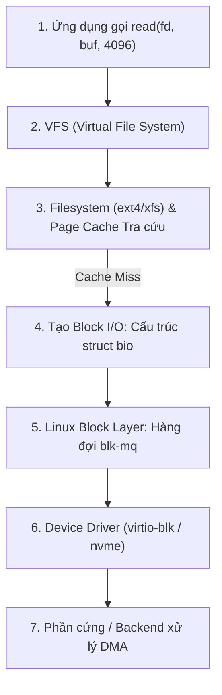

## Mục lục
1. Bảng thuật ngữ
2. Nội dung kiến thức và kết quả cần đạt
3. Ranh giới User Space và Kernel Space: An toàn vs. Hiệu năng
4. Hành trình chi tiết của một lệnh `read()` (Cache Miss)
5. Cơ chế DMA: Thiết bị di chuyển dữ liệu và "Cú lừa" Zero-Copy
6. Nhận diện I/O hoàn tất: Ngắt (Interrupt) vs. Thăm dò (Polling)
7. Bóc tách 3 khái niệm dễ nhầm: Syscall, Chờ I/O và Context Switch
8. Liên hệ kiến trúc: SPDK vhost-user-blk & Bài toán máy ảo OpenStack
9. Đi sâu: So sánh luồng ghi dữ liệu — Kernel Datapath vs. SPDK Datapath
10. Kết luận 

## Bảng thuật ngữ

| Thuật ngữ | Định nghĩa bản chất |
| :--- | :--- |
| **User Space (Ring 3)** | Không gian bộ nhớ và mức đặc quyền dành cho ứng dụng thông thường (hoặc tiến trình QEMU, SPDK). Ứng dụng không thể can thiệp trực tiếp vào phần cứng. |
| **Kernel Space (Ring 0)** | Không gian đặc quyền tối cao của nhân Linux. Nơi quản lý bộ nhớ, filesystem, bộ điều phối task (scheduler) và driver thiết bị. |
| **System Call (Syscall)** | Giao diện cổng kiểm soát cho phép ứng dụng User Space yêu cầu dịch vụ từ Kernel (chuyển đổi mức đặc quyền CPU). |
| **VFS (Virtual File System)** | Tầng trừu tượng hóa của Linux giúp đồng nhất mọi hệ thống tệp (`ext4`, `xfs`, `btrfs`, `NFS`) thành một giao diện hàm chung (`open`, `read`, `write`). |
| **Block Layer (`blk-mq`)** | Tầng trung gian trong Linux quản lý việc gom cụm, xếp thứ tự và điều phối các yêu cầu khối xuống đĩa thông qua kiến trúc đa hàng đợi (Multi-Queue). |
| **DMA (Direct Memory Access)** |Tính năng phần cứng cho phép thiết bị ngoại vi (NVMe SSD, Card mạng) tự đọc/ghi trực tiếp vào RAM mà CPU không cần bốc vác từng byte. |
| **IOVA / DMA Address** | Địa chỉ bộ nhớ theo góc nhìn của thiết bị ngoại vi trên bus truyền dẫn (PCIe), được ánh xạ qua phần cứng IOMMU. |
| **Interrupt (Ngắt phần cứng)** |Tín hiệu điện từ thiết bị gửi tới CPU để thông báo: *"Tôi đã xử lý xong gói tin/khối dữ liệu, hãy vào nghiệm thu"*. |
| **Polling (Thăm dò)** | Cơ chế CPU chạy một vòng lặp liên tục để tự kiểm tra thanh ghi hoặc hàng đợi xem công việc đã xong chưa, không cần chờ tín hiệu ngắt. |
| **Context Switch** | Thao tác CPU cất toàn bộ trạng thái (thanh ghi, con trỏ bộ nhớ) của tiến trình hiện tại để nạp trạng thái của một tiến trình khác vào thực thi. |
| **Virtqueue** | Cấu trúc dạng vòng tròn (Ring Buffer) trên RAM chia sẻ giữa Guest VM và Host, đóng vai trò "bảng giao việc" I/O giữa driver `virtio-blk` của Guest và backend xử lý phía Host. |
| **vhost-user-blk** | Giao thức cho phép backend block (như SPDK) chạy ở User Space của Host, đọc trực tiếp Virtqueue trên bộ nhớ chia sẻ (Hugepages) thay vì để QEMU làm backend. |
| **Control Plane / Data Plane** | Control Plane: thiết lập, thương lượng kết nối (qua Unix socket). Data Plane: luồng dữ liệu I/O thực tế (qua Shared Memory). |
| **irqfd** | Cơ chế của KVM để backend kích hoạt ngắt ảo (Virtual Interrupt) đánh thức vCPU của Guest khi I/O hoàn tất. |

---

## Nội dung kiến thức và kết quả cần đạt

1. **Vẽ lại và giải thích được luồng dữ liệu** của một lệnh đọc không trúng cache (`read()` cache miss) từ User Space xuyên qua các lớp của Linux Kernel xuống phần cứng.
2. **Hiểu đúng bản chất của DMA**: Phân biệt được việc thiết bị ghi vào RAM không tốn CPU với việc CPU vẫn phải tốn tài nguyên copy giữa các bộ đệm phần mềm (Memory Copy).
3. **Phân định rạch ròi 3 hiện tượng**: Syscall (đổi quyền), Chờ I/O (trạng thái ngủ), và Context Switch (đổi task).
4. **Đánh giá khách quan giữa Interrupt và Polling**: Tránh thiên kiến nhị nguyên *"Interrupt là tệ, Polling luôn tốt"*.
5. **Chỉ rõ vị trí SPDK can thiệp**: Trong mô hình ảo hóa VM, giải pháp SPDK `vhost-user-blk` thay thế đoạn nào trên Host, và đoạn nào của Guest Kernel vẫn giữ nguyên.
6. **So sánh được từng bước** luồng ghi dữ liệu (write) giữa Kernel Datapath và SPDK Datapath, từ Virtqueue cho đến Storage Target, cả chiều đi lẫn chiều Completion.
7. **Giải thích đúng vai trò của Unix socket trong `vhost-user`** (Control Plane) và trả lời được QEMU, Guest Kernel còn làm gì khi dùng SPDK `vhost-user-blk`.

---

## 1. Ranh giới User Space và Kernel Space: An toàn vs. Hiệu năng

Hãy hình dung một **ngân hàng lớn**:

```text
[KHÁCH HÀNG - User Space]     → Muốn: "Rút 5 triệu đồng từ tài khoản"
             │
             ▼ (Đi qua cửa kiểm soát / Xếp hàng lấy số)
[GIAO DỊCH VIÊN - Syscall]    → Xác minh CMND, kiểm tra số dư, đóng dấu phê duyệt
             │
             ▼ (Cửa khóa an ninh đặc biệt - Ring 0)
[KHO TIỀN - Kernel Space]     → Quản lý tiền mặt, két sắt vật lý, sổ cái hệ thống
```

- **Vì sao phải tách biệt?**

    Nếu cho phép mọi khách hàng tự do đi thẳng vào kho tiền (ứng dụng ghi trực tiếp vào thanh ghi phần cứng của SSD), một ứng dụng bị lỗi con trỏ hoặc nhiễm mã độc sẽ ghi đè và phá hủy toàn bộ dữ liệu của hệ điều hành và các ứng dụng khác.

- **Cơ chế bảo vệ bằng phần cứng (CPU Rings):**

    - **Ring 3 (User Space):** Ứng dụng chạy ở mức đặc quyền thấp nhất. Mọi truy cập trái phép vào địa chỉ bộ nhớ của Kernel hoặc chỉ lệnh phần cứng nhạy cảm đều bị CPU chặn đứng (sinh lỗi `Segmentation Fault`).

    - **Ring 0 (Kernel Space):** Nhân hệ điều hành có toàn quyền truy xuất bộ nhớ và điều khiển thiết bị ngoại vi.

- **Cái giá phải trả (The Overhead):**

    Mỗi khi ứng dụng cần đọc/ghi đĩa, nó bắt buộc phải phát một **System Call (`read()`, `write()`)**. CPU phải lưu trạng thái thanh ghi của ứng dụng, đổi cờ đặc quyền từ Ring 3 sang Ring 0, thực thi mã kiểm tra an ninh trong Kernel, rồi lại đổi ngược từ Ring 0 về Ring 3 để trả kết quả.

---

## 2. Hành trình chi tiết của một lệnh `read()` (Cache Miss)

Giả sử một chương trình trong máy ảo (VM) phát lệnh đọc 4 KiB từ file `/data/report.txt`, và khối dữ liệu này **chưa hề có trong RAM (Page Cache Miss)**.



### Chi tiết 5 trạm xử lý trong Kernel:

#### Trạm 1: VFS (Virtual File System)

- Ứng dụng truyền vào một con số nguyên trừu tượng gọi là **File Descriptor (fd)**.

- VFS tiếp nhận, tra cứu bảng quản lý file của tiến trình để xác định `fd` này tương ứng với Inode nào, thuộc filesystem nào (ext4, xfs, hay nfs) để chuyển tiếp hàm đọc phù hợp.

#### Trạm 2: Filesystem tra cứu & Quyết định Cache

- Driver của Filesystem (ví dụ `ext4`) tra cứu cấu trúc cây dữ liệu (Extent Tree/B-Tree) để tìm xem 4 KiB của file này nằm tại các **LBA logic** nào trên đĩa.

- Kernel kiểm tra **Page Cache** của Guest. Vì là **Cache Miss**, Kernel cấp phát một trang RAM trống (4 KiB) và đánh dấu trạng thái đang chờ dữ liệu.

#### Trạm 3: Đóng gói thành `struct bio`

- Filesystem tạo ra đối tượng cơ sở của Linux Block Layer: `struct bio`.

- Cấu trúc này gói gọn thông tin: _Đọc từ LBA bắt đầu là bao nhiêu, độ dài bao nhiêu sector, và sau khi đọc xong thì ghi dữ liệu vào địa chỉ trang RAM nào_.

#### Trạm 4: Tầng điều phối khối đa hàng đợi (`blk-mq`)

- Trước Linux 3.13, Linux chỉ có một hàng đợi đơn (`request_queue`) được bảo vệ bằng một khóa lớn (Global Lock). Khi hệ thống có hàng chục CPU core cùng đẩy I/O xuống một ổ SSD NVMe nhanh, các core liên tục tranh chấp lock này khiến hiệu năng bị bóp nghẹt.

- **Kiến trúc `blk-mq` (Block Multi-Queue) hiện đại:**

    ```text
    [CPU Core 0]   [CPU Core 1]   [CPU Core N]  --> Software Staging Queues (Mỗi Core 1 hàng)
          │              │              │           (Không còn tranh chấp Lock)
          └──────────────┼──────────────┘
                         ▼
            Hardware Dispatch Queues             --> Tương ứng trực tiếp với số Queue
                         ▼                           của phần cứng SSD NVMe
                  [ NVMe Controller ]
    ```

    `blk-mq` phân loại, gom các I/O lân cận nhau lại (I/O merging), sắp xếp thứ tự và đẩy nhanh vào hàng đợi phần cứng.

#### Trạm 5: Driver thiết bị (Device Driver)

- Driver (ví dụ `virtio-blk` trong VM hoặc `nvme` trên Host) dịch `bio` thành định dạng lệnh chuẩn mà phần cứng hiểu được (NVMe Command Submission).

- Driver ghi lệnh vào bộ nhớ chia sẻ và gõ chuông (**Doorbell register**) để đánh thức thiết bị bắt đầu làm việc.

> Bản chất của Queue Depth đa tầng
> 
> Khi bạn cấu hình công cụ đo (như `fio`) với tham số `iodepth=64`, con số này chỉ là độ sâu hàng đợi **ở tầng ứng dụng**. Dọc đường đi, yêu cầu còn phải xếp hàng tại hàng đợi của `blk-mq`, hàng đợi của driver, và ring-buffer bên trong chip điều khiển của SSD/SAN target. Tắc nghẽn ở bất kỳ tầng nào cũng sẽ đẩy Tail Latency tăng vọt.

---

## 3. Cơ chế DMA: Thiết bị di chuyển dữ liệu và "Cú lừa" Zero-Copy

Sau khi nhận lệnh, làm thế nào để 4 KiB dữ liệu bay từ chip nhớ của SSD vào được thanh RAM của máy tính?

### 1. Sự tiến hóa: Từ PIO sang DMA

```text
[ CƠ CHẾ CŨ: PIO (Programmed I/O) ]
Thiết bị  ──(1 byte)──>  CPU Register  ──(1 byte)──>  RAM
* CPU đóng vai cửu vạn: Chạy vòng lặp copy từng byte, hoàn toàn bị phong tỏa năng lực tính toán.

[ CƠ CHẾ HIỆN ĐẠI: DMA (Direct Memory Access) ]
CPU: Cấp phát RAM -> Giao địa chỉ cho Thiết bị -> Đi làm việc khác!
Thiết bị  ═══════════(Tự đẩy dữ liệu qua Bus PCIe)═══════════>  RAM
```

- **DMA Engine:** Là một vi xử lý chuyên trách nằm ngay trên bo mạch của card mạng hoặc SSD Controller. Nó được cấp quyền tự do truy cập thẳng vào hệ thống bus máy tính để đọc/ghi bộ nhớ RAM.

### 2. Sự lệch pha về địa chỉ: CPU vs. Thiết bị (IOMMU)

- **CPU nhìn thế giới qua Địa chỉ ảo (Virtual Address - VA):** Do hệ điều hành phân trang bộ nhớ quản lý.

- **Thiết bị ngoại vi nhìn thế giới qua Địa chỉ Bus (IOVA / Physical Address):** Thiết bị PCIe không thể tự hiểu cấu trúc bảng trang ảo phức tạp của CPU.

- **Vai trò của Kernel & IOMMU:**

    Kernel phải thực hiện thao tác **DMA Mapping** (chuyển đổi vùng đệm ảo của CPU thành danh sách địa chỉ vật lý liền mạch hoặc phân tán). Bộ điều khiển **IOMMU (Input-Output Memory Management Unit)** của phần cứng sẽ đứng ra kiểm soát an ninh, chỉ cho phép card SSD đọc/ghi đúng ô RAM đã được cấp phép.

### 3.  "DMA KHÔNG ĐỒNG NGHĨA VỚI ZERO-COPY"

Nhiều tài liệu đơn giản hóa thường viết: _"Có DMA nghĩa là Zero-Copy"_. Đây là một quan niệm sai lầm phổ biến.

Hãy phân biệt rạch ròi:

- **DMA:** Đảm bảo **Zero-Copy giữa Phần cứng $\leftrightarrow$ RAM**. CPU không tốn chu kỳ tính toán để nhặt từng byte từ cổng I/O.

- **Phần mềm (Hệ điều hành):** Vẫn có thể thực hiện **Memory Copy (`memcpy`) giữa RAM $\leftrightarrow$ RAM** do cấu trúc phân tầng bảo mật!

```text
[ SSD / Storage ]
       │
       │  (1) DMA Transfer: Tự nạp vào RAM (Không tốn CPU)
       ▼
[ Page Cache của Kernel (RAM) ]
       │
       │  (2) CPU MEMCPY: Kernel dùng CPU copy dữ liệu từ Ring 0 sang Ring 3!
       ▼
[ Bộ đệm của Ứng dụng (RAM) ]
```

- **Lần 1 (Thiết bị $\rightarrow$ Page Cache):** Chạy bằng **DMA**. Không tốn CPU.

- **Lần 2 (Page Cache $\rightarrow$ User Buffer):** Để đảm bảo ứng dụng không đọc trộm dữ liệu vùng nhớ Kernel, CPU bắt buộc phải chạy lệnh **`memcpy`** để nhân bản 4 KiB dữ liệu đó sang bộ đệm của ứng dụng.

- **Với `O_DIRECT`:** Dữ liệu được DMA thẳng vào User Buffer, loại bỏ được bước (2). Tuy nhiên, nếu vùng nhớ User Buffer không được căn chỉnh kích thước chuẩn xác (alignment), hoặc khi đi qua các lớp ảo hóa cần bộ đệm dội (**Bounce Buffer**), Kernel vẫn buộc phải tạo bản sao trung gian.

---

## 4. Nhận diện I/O hoàn tất: Ngắt (Interrupt) vs. Thăm dò (Polling)

Sau khi thiết bị đã dùng DMA đổ xong 4 KiB dữ liệu vào RAM, làm sao để phần mềm biết mà vào đọc?

```text
[ CƠ CHẾ NGẮT (Interrupt-driven) ]
Ứng dụng chờ I/O (Ngủ) ──> Thiết bị xong việc ──> Bắn tín hiệu điện (Interrupt) ──> CPU dừng việc ──> Đánh thức Ứng dụng

[ CƠ CHẾ THĂM DÒ (Polling / PMD) ]
Ứng dụng / SPDK Core ──> Chạy vòng lặp liên tục: "Xong chưa? ... Xong chưa? ... Xong!" ──> Bốc dữ liệu xử lý ngay
```

### So sánh kỹ thuật toàn diện

| **Tiêu chí** | **Cơ chế Ngắt (Interrupt-driven)** | **Cơ chế Thăm dò (Polling / PMD)** |
| --- | --- | --- |
| **Cách thức hoạt động** | Thiết bị phát tín hiệu ngắt phần cứng (MSI-X) qua bus PCIe lên CPU. CPU tạm dừng luồng công việc hiện tại để chạy hàm phục vụ ngắt (ISR). | CPU chủ động chạy vòng lặp vô tận (Busy-loop) đọc liên tục vào hàng đợi hoàn tất (Completion Queue). |
| **Ưu điểm lớn nhất** | **Tiết kiệm tài nguyên:** Khi không có I/O, CPU có thể ngủ, hạ xung nhịp để tiết kiệm điện, hoặc nhường tài nguyên chạy ứng dụng khác. | **Độ trễ thấp tuyệt đối:** Nhận biết kết quả ngay tức thì ở cấp độ nano-giây. **Đè bẹp hiện tượng vọt trễ (Tail Latency P99/P99.99)**. |
| **Nhược điểm lớn nhất** | **Overhead và Jitter:** Tốn thời gian tiếp nhận ngắt, đổi ngữ cảnh, dọn hàng đợi ngắt. Khi tải cao (hàng triệu IOPS), CPU bị quá tải vì bão hòa ngắt (Interrupt Storm). | **Lãng phí CPU:** Core chạy polling luôn hiển thị **100% CPU usage** trên `top`/`htop`, bất kể có I/O chạy qua hay đang rảnh rỗi. |
| **Ngữ cảnh sử dụng** | Hệ thống lưu trữ thông thường, tải trung bình, ổ HDD, SSD SATA, hoặc môi trường ảo hóa dùng chung tài nguyên CPU. | Hệ thống lưu trữ siêu hiệu năng (SPDK), mạng tốc độ cao (DPDK), nơi SLA đòi hỏi độ trễ cực thấp và ổn định tuyệt đối. |

> : "Interrupt luôn dở, Polling luôn xịn"?
> 
> **Không có giải pháp nào hoàn hảo cho mọi trường hợp.**
> 
> - Nếu một ngày chỉ có vài chục request I/O phát sinh mà bạn gán cứng một CPU Core chạy Polling 100%, bạn đang lãng phí điện năng và năng lực tính toán nghiêm trọng.
> 
> - Linux Kernel hiện đại cũng đã hỗ trợ **I/O Polling** (thông qua giao diện `io_uring` với cờ `IORING_SETUP_IOPOLL`).
> 
> - Ngược lại, SPDK cũng tích hợp cơ chế **Interrupt Mode** (cho phép thread SPDK rơi vào trạng thái ngủ khi rảnh và chỉ thức dậy bằng ngắt), giúp cân bằng giữa hiệu năng và điện năng tiêu thụ.

---

## 5. Bóc tách 3 khái niệm dễ nhầm: Syscall, Chờ I/O và Context Switch

Khi bàn về sự chậm chạp của Kernel, ba khái niệm này thường xuyên bị gom chung thành một cục. Đây là nguồn gốc của rất nhiều nhận định kỹ thuật sai lệch.

```text
               +-----------------------------------------------------------+
  1. SYSCALL   | App gọi read() -> CPU đổi quyền từ Ring 3 sang Ring 0     |  (CÙNG TIẾN TRÌNH)
               +-----------------------------------------------------------+
                                             │
                                     Dữ liệu có trong RAM?
                                      /              \
                           (CÓ: Cache hit)         (KHÔNG: Cache miss)
                                    /                  \
                        Trả kết quả về ngay     +-------------------------------+
                                                | 2. CHỜ I/O: Tiến trình rơi    |
                                                | vào trạng thái ngủ (Blocked)  |
                                                +-------------------------------+
                                                               │
                                                +-------------------------------+
  2. CONTEXT SWITCH                             | Linux Scheduler nhấc Task     |  (ĐỔI TIẾN TRÌNH)
                                                | KHÁC lên CPU để chạy thế chỗ  |
                                                +-------------------------------+
```

### 1. System Call (Syscall): Đổi quyền hạn, không đổi người

- Ứng dụng nhờ Kernel làm việc thông qua một lời gọi hàm hệ thống.

- **Bản chất:** CPU chỉ đổi mức đặc quyền phần cứng (từ Ring 3 sang Ring 0) để chạy tiếp các dòng lệnh an ninh của Kernel.

- **Thực tế:** **Vẫn chính là tiến trình đó đang sở hữu CPU**, không hề có sự đổi người. Chi phí của syscall thuần túy là việc cất và khôi phục một vài thanh ghi điều khiển.

### 2. Chờ I/O (I/O Blocking): Đi ngủ chờ chuông báo

- Xảy ra khi một tiến trình yêu cầu dữ liệu nhưng dữ liệu chưa có sẵn trong RAM (hoặc ứng dụng gọi `fsync()`).

- Vì không thể tính toán tiếp nếu thiếu dữ liệu, tiến trình tự chuyển sang trạng thái ngủ (`TASK_UNINTERRUPTIBLE`).

- Điểm quan trọng: Bản thân lệnh `read()` **không tự động gây ra chờ I/O**. Nếu dữ liệu đã nằm sẵn trong Page Cache, `read()` lấy dữ liệu ra và trả về ngay tức khắc.

### 3. Context Switch (Chuyển đổi ngữ cảnh): Đổi người trên ghế lái

- Khi tiến trình cũ đi ngủ (để chờ I/O), hoặc khi nó đã dùng hết lượt thời gian CPU được cấp (Time Slice), bộ điều phối (Linux Scheduler) sẽ can thiệp.

- Scheduler đẩy tiến trình cũ ra khỏi CPU, lưu toàn bộ trạng thái bộ nhớ của nó, và bốc một tiến trình hoàn toàn khác đặt lên CPU để tiếp tục xử lý.

- **Tác hại thực sự của Context Switch:**

    Không chỉ tốn vài micro-giây để tráo đổi thanh ghi, mà nó còn làm **"ô nhiễm bộ nhớ đệm" (CPU Cache Pollution)**. Toàn bộ dữ liệu của tiến trình cũ nằm trong cache L1/L2/L3 bị tiến trình mới đè lên. Khi tiến trình cũ thức dậy, nó liên tục gặp Cache Miss, khiến hệ thống bị giật cục.

> [!TIP] Tóm tắt bản chất bằng 3 câu:
> 
> - **Syscall:** Ứng dụng **nhờ Kernel làm việc hộ** (vẫn mình ngồi ghế CPU).
> 
> - **Interrupt:** Thiết bị **gõ cửa báo tin** cho CPU.
> 
> - **Context Switch:** Hệ điều hành **đuổi mình xuống để người khác lên ngồi**.

---

## 6. Liên hệ kiến trúc: SPDK vhost-user-blk & Bài toán máy ảo OpenStack

Khi tài liệu kỹ thuật tuyên bố: _"SPDK tối ưu bằng cách bỏ qua toàn bộ Kernel (Kernel Bypass)"_, một kỹ sư hệ thống cần phải đặt câu hỏi phản biện: **"Bỏ qua Kernel nào? Ở phân đoạn nào?"**

Trong mô hình máy ảo OpenStack, hệ thống tồn tại **hai Kernel hoàn toàn tách biệt**:

```text
============================== KHÔNG GIAN GUEST (MÁY ẢO) ==============================
  [ Ứng dụng trong VM ]
          │ (Syscall read/write)
          ▼
  [ GUEST KERNEL ] ──> VFS ──> Filesystem (ext4/xfs) ──> Driver virtio-blk
  * LƯU Ý SỐNG CÒN: Tầng này VẪN TỒN TẠI NGUYÊN VẸN 100%, SPDK không can thiệp vào đây!
========================================================================================
                                          │
                                 (Đường truyền I/O)
                                          ▼
============================== KHÔNG GIAN HOST (MÁY CHỦ COMPUTE) =======================
  [ PHƯƠNG ÁN TRUYỀN THỐNG: KERNEL DATA-PATH ]
  VM-Exit ──> QEMU Process ──(Syscall)──> HOST KERNEL ──> Block Layer ──> iSCSI Driver
  (Nhiều lần đổi ngữ cảnh, dội cache, chịu sự điều phối ngắt của Host Kernel)

  [ PHƯƠNG ÁN MỚI: SPDK DATA-PATH (Mục tiêu dự án của bạn) ]
  VM Memory ═══════════[ Vhost-user Shared Memory / Hugepages ]═══════════> SPDK Target
                                                                               │
  * Bypass hoàn toàn Host Kernel!                                              ▼
  * Polling Mode (PMD) trên CPU Pinning                                 SPDK bdev Layer
  * Lockless Ring Buffer                                                       │
                                                                               ▼
  NetApp SDS Target <═══════(RDMA / RoCEv2 qua NIC Mellanox)═══════ SPDK NVMe-oF Driver
========================================================================================
```

### Bóc tách 3 phân đoạn cụ thể:

| **Phân đoạn** | **Cách truyền thống (Kernel)** | **Giải pháp SPDK (Mục tiêu tối ưu)** | **Trọng tâm công việc Job 1 của bạn** |
| --- | --- | --- | --- |
| **Đoạn 1: Trong lòng Guest VM** | App $\rightarrow$ Guest Kernel $\rightarrow$ `virtio-blk`. | **Giữ nguyên 100%.** Guest VM hoàn toàn không biết phía dưới đang dùng SPDK hay QEMU. | Không can thiệp vào code của Guest. |
| **Đoạn 2: Từ Guest sang Host Compute** | Dữ liệu đi qua QEMU, gây ngắt ảo hóa (`VM-Exit`) và gọi syscall vào Host Kernel. | **`vhost-user-blk`:** Dùng chung bộ nhớ vật lý (**Shared Hugepages**). VM ghi vào ring buffer, SPDK ở User Space bốc đi ngay. Không syscall, không VM-Exit. | **Trọng tâm chính:** Cấu hình Flavor OpenStack bật Hugepages, viết code sửa Libvirt sinh XML `<disk type='vhostuser'>`. |
| **Đoạn 3: Từ Compute sang Storage Target** | Host Kernel đóng gói iSCSI qua network stack của Linux (chịu overhead ngắt mạng TCP). | **SPDK NVMe-oF Initiator:** Điều khiển trực tiếp card mạng Mellanox bằng cơ chế Polling và truyền qua RDMA. | Viết Python wrapper gọi SPDK JSON-RPC tạo kết nối bdev NVMe-oF tới NetApp SDS. |

---

## 7. Đi sâu: So sánh luồng ghi dữ liệu — Kernel Datapath vs. SPDK Datapath
Để thấy rõ SPDK thay đổi điều gì, ta đặt hai phương án vào cùng một tình huống cụ thể: **Ứng dụng trong Guest VM ghi một khối dữ liệu xuống ổ đĩa ảo `/dev/vdb` (đã bypass hoặc xả khỏi Page Cache của Guest)**.

### Giai đoạn 1: Nửa chặng đầu (Hoàn toàn giống nhau ở cả 2 phương án)

Trước khi dữ liệu rời khỏi máy ảo, toàn bộ các bước diễn ra bên trong Guest VM là **như nhau**:

```text
[ Ứng dụng trong VM ]
         │ Ghi dữ liệu (write / O_DIRECT)
         ▼
[ Filesystem trong Guest (ext4/xfs) ]
         │ Dịch file thành LBA logic
         ▼
[ Guest Block Layer (blk-mq) ]
         │ Đóng gói thành struct bio / request
         ▼
[ Driver virtio-blk (Guest Kernel) ]
         │ Ghi thông tin I/O vào hàng đợi
         ▼
[ Virtqueue (Bảng giao việc trên RAM) ]
```

- **Virtqueue là gì?**
  Đây là cấu trúc dữ liệu dạng vòng tròn (**Ring Buffer**) nằm trên bộ nhớ RAM được chia sẻ giữa VM và Host.
- **Hình dung thực tế:** Virtqueue giống như một **"bảng giao việc"**:
  - Guest Driver ghi vào bảng: *"Tôi có 4 KiB dữ liệu ở ô nhớ $X$, hãy ghi nó vào LBA $Y$ của ổ đĩa, xong thì tích vào ô $Z$ cho tôi."*
  - Sau khi điền xong bảng giao việc, quyền xử lý thuộc về phía Compute Host.

**Từ điểm này, hệ thống rẽ thành hai hướng tiếp cận hoàn toàn khác nhau.**

### Giai đoạn 2: Ngã rẽ tại Compute Host

```text
========================================================================================
[ HÀNG ĐỢI VIRTQUEUE TỪ GUEST ]
========================================================================================
             │                                              │
             ▼ (Phương án A: Kernel Datapath)              ▼ (Phương án B: SPDK Datapath)
+------------------------------------------+    +------------------------------------------+
| 1. QEMU Block Backend                    |    | 1. SPDK vhost-user-blk Target            |
|    - Nhận request từ virtqueue           |    |    - Trực tiếp đọc virtqueue trên RAM    |
|    - Gọi syscall (AIO / io_uring)        |    |      chia sẻ (Hugepages)                 |
|                   │                      |    |    - Chạy ở User Space, Polling liên tục |
|                   ▼                      |    +------------------------------------------+
| 2. Host Kernel Storage Stack             |                         │
|    - VFS / Block Layer trên Host         |                         ▼
|    - Device Mapper / Multipath           |    +------------------------------------------+
|    - Kernel iSCSI Initiator              |    | 2. SPDK bdev (Block Device Layer)        |
|                   │                      |    |    - Trừu tượng hóa ổ đĩa ở User Space   |
|                   ▼                      |    +------------------------------------------+
| 3. Host Network Stack (TCP/IP Kernel)    |                         │
|    - Socket buffer (sk_buff)             |                         ▼
|    - Chịu ngắt mạng (Network IRQ)        |    +------------------------------------------+
|                   │                      |    | 3. SPDK NVMe-oF Initiator                |
|                   ▼                      |    |    - User-space driver cho card mạng     |
+------------------------------------------+    |    - Truyền trực tiếp qua RDMA / RoCEv2  |
                    │                           +------------------------------------------+
                    │                                        │
                    └───────────────────┬────────────────────┘
                                        ▼
                   [ Storage Target qua mạng (NetApp SDS) ]
```

#### Phương án A: Backend dùng đường Kernel truyền thống

1. **QEMU tiếp nhận:** Tiến trình QEMU đóng vai trò giả lập phần cứng. Nó đọc Virtqueue rồi dùng System Call của Host (như POSIX AIO hoặc io_uring) để đẩy lệnh xuống Linux Kernel của Host.
2. **Host Kernel xử lý đa tầng:** Lệnh đi qua Block Layer của Host, qua lớp quản lý đa đường (`multipath`), rồi vào driver **iSCSI Initiator** nằm trong Kernel.
3. **Mạng Kernel:** Driver iSCSI đóng gói dữ liệu vào các gói tin TCP/IP chuẩn của Linux, gửi qua card mạng vật lý để đến tủ đĩa NetApp.

#### Phương án B: Backend dùng SPDK vhost-user-blk

1. **SPDK vhost-user-blk tiếp nhận:** SPDK là một tiến trình chạy độc lập ở User Space của Host. Nhờ cấu hình **Shared Memory / Hugepages**, SPDK ánh xạ thẳng vùng RAM của VM vào không gian nhớ của mình. Worker thread của SPDK (chạy polling) thấy việc mới trong Virtqueue là **tự bốc đi xử lý ngay lập tức, không qua QEMU, không gọi bất kỳ syscall nào vào Host Kernel**.
2. **SPDK `bdev` định tuyến:** Tầng trừu tượng hóa `bdev` của SPDK chuyển lệnh I/O sang module tương ứng mà không gặp phải các loại lock hàng đợi của Linux Kernel.
3. **SPDK NVMe-oF Initiator:** SPDK sở hữu driver mạng riêng chạy ở User Space. Nó dùng cơ chế **RDMA (RoCEv2)** để ra lệnh cho card mạng (Mellanox ConnectX) bốc thẳng dữ liệu từ RAM đẩy qua mạng tới tủ NetApp mà không cần Host CPU copy dữ liệu (`zero-copy`).

### Giải mã chi tiết: Socket Unix trong `vhost-user` dùng để làm gì?

Một hiểu lầm rất phổ biến: *"Dữ liệu từ máy ảo được bơm qua file socket Unix (`.sock`) để sang SPDK"*. **Thực tế hoàn toàn không phải vậy.**

```text
[ Control Plane - Thiết lập ban đầu ]
QEMU  <======(Unix Domain Socket)======>  SPDK
- Gửi tin nhắn bắt tay (Handshake).
- QEMU gửi File Descriptor (FD) của vùng nhớ RAM / Hugepages sang cho SPDK.
- SPDK dùng FD đó để gọi lệnh mmap(), nhìn thấy toàn bộ RAM của VM.

[ Data Plane - Dữ liệu I/O thực tế ]
VM Memory (Hugepages)  <══════════════════════════════>  SPDK Core
- Dữ liệu và Virtqueue nằm cố định trên RAM vật lý.
- Hai bên đọc/ghi trực tiếp vào RAM, TUYỆT ĐỐI KHÔNG đi qua socket Unix.
```

- File Unix Domain Socket chỉ dùng ở tầng **Control Plane**: thiết lập kết nối, đồng bộ kích thước bộ nhớ, địa chỉ hàng đợi Virtqueue khi khởi động VM.
- Khi hệ thống đã chạy, toàn bộ lưu lượng dữ liệu (Data Plane) đi qua **Shared Memory**. Băng thông lúc này tương đương tốc độ đọc/ghi RAM nội bộ, không có chi phí serialize gói tin qua socket.

### Giai đoạn 3: Chiều Completion — Kết quả trả về ứng dụng ra sao?

Lệnh ghi chỉ thực sự hoàn thành khi tín hiệu xác nhận từ Storage Target quay ngược trở lại ứng dụng bên trong VM:

```text
[1. Storage Target báo xong]
              │
              ▼
[2. Backend trên Compute Host nhận kết quả]
   - Kernel Datapath: Card mạng bắn ngắt phần cứng (IRQ) -> Host Kernel xử lý -> Báo về QEMU.
   - SPDK Datapath: Worker thread của SPDK (Polling) phát hiện Completion Queue có tin mới ngay lập tức.
              │
              ▼
[3. Đánh dấu vào Virtqueue]
   - Backend ghi trạng thái "Success" vào cấu trúc Virtqueue (Used Ring) trên RAM chia sẻ.
              │
              ▼
[4. Báo về cho Guest VM]
   - Backend kích hoạt ngắt ảo hóa (Virtual Interrupt qua irqfd/KVM) để đánh thức Guest vCPU.
              │
              ▼
[5. Guest Kernel nghiệm thu]
   - Driver virtio-blk xử lý kết quả, đánh thức luồng ứng dụng đang chờ.
              │
              ▼
[6. Ứng dụng nhận kết quả ghi thành công]
```

> [!NOTE] Điểm mấu chốt về Polling và Interrupt
> Việc *"SPDK dùng Polling"* chỉ diễn ra ở **tầng Host (giữa SPDK và phần cứng mạng/storage)**. Sau khi SPDK xong việc, nó vẫn phải dùng cơ chế ngắt ảo hóa (`irqfd`) để báo cho Guest VM biết. Do đó, **bên trong Guest VM, cơ chế ngắt (Interrupt) vẫn diễn ra bình thường để phục hồi tiến trình**.

### Bảng đối chiếu tổng kết hai phương án

| Thành phần | Phương án A: Kernel Datapath | Phương án B: SPDK Datapath |
| --- | --- | --- |
| **Bên trong Guest VM** | App $\rightarrow$ ext4/xfs $\rightarrow$ `blk-mq` $\rightarrow$ `virtio-blk` | **Y hệt Phương án A (Không đổi gì cả)** |
| **Tiến trình QEMU** | Vừa chạy VM, vừa trực tiếp làm backend xử lý I/O | Chỉ chạy VM và bắt tay ban đầu qua Unix socket |
| **Xử lý Virtqueue** | QEMU đọc Virtqueue qua System Call | SPDK tự đọc trực tiếp từ Shared Hugepages |
| **Tầng Block Host** | Linux Block Layer (`blk-mq`), Multipath | SPDK `bdev` layer (User Space, Lockless) |
| **Giao thức mạng** | iSCSI qua Kernel TCP/IP Network Stack | NVMe-oF qua SPDK Driver (Polling + RDMA) |
| **Tiêu tốn CPU Host** | Tăng theo số lần Context Switch và Ngắt (IRQ) | Tốn cố định 100% trên các CPU Core được pin cho SPDK |
| **Tính năng ảo hóa** | Đầy đủ: Snapshot QEMU, backup qcow2, live migration | Hạn chế: Snapshot/backup phải đẩy về SAN (NetApp) |

### Câu hỏi kiểm tra kiến thức: Trong mô hình SPDK `vhost-user-blk`, QEMU và Guest Kernel còn làm những việc gì?

Khi phân tích giải pháp này trước hội đồng kỹ thuật, đây là câu trả lời chính xác để khẳng định bạn nắm vững bản chất kiến trúc:

#### 1. Guest Kernel còn làm gì?

- **Làm toàn bộ công việc như một hệ điều hành độc lập:** Tiếp nhận lời gọi hệ thống từ ứng dụng, quản lý Page Cache, duy trì cấu trúc Filesystem (thư mục, Inode, Metadata), chia nhỏ I/O thành `struct bio` trong `blk-mq`.
- **Điều khiển thiết bị ảo:** Driver `virtio-blk` của Guest vẫn phải chịu trách nhiệm format dữ liệu theo chuẩn Virtio và xếp vào bảng giao việc `Virtqueue`.
- **Xử lý ngắt trả về:** Tiếp nhận tín hiệu hoàn tất từ Host để đánh thức tiến trình ứng dụng.

#### 2. QEMU còn làm gì?

- **Quản lý vòng đời VM:** QEMU kết hợp với KVM để cấp phát vCPU, quản lý bảng phân trang bộ nhớ của máy ảo (EPT/NPT).
- **Thiết lập kết nối ban đầu (Control Plane):** Khởi tạo socket Unix, thương lượng tính năng với SPDK daemon, trao File Descriptor của vùng nhớ Hugepages cho SPDK.
- **Xử lý các thiết bị ảo khác:** Bàn phím, chuột, màn hình console (VNC/SPICE), card mạng thông thường, bus PCI ảo của VM.
- **Điều QEMU KHÔNG CÒN LÀM:** Nó **không còn chạm tay vào bất kỳ byte dữ liệu I/O nào** của ổ đĩa `/dev/vdb` nữa. Dữ liệu I/O đã được "ủy quyền trọn gói" cho SPDK chạy độc lập bên cạnh.

---

## Kết luận & tổng kết cốt lõi 80/20

Toàn bộ bài xoay quanh một câu hỏi: **một lệnh I/O đi qua những tầng nào, mỗi tầng tốn gì, và SPDK cắt bỏ đúng đoạn nào?**

### A. Nền tảng: I/O trong Linux 

1. **Ranh giới User/Kernel sinh ra để bảo vệ hệ thống**, nhưng tạo ra độ trễ do chuyển đổi đặc quyền (Syscall) và việc phải sao chép dữ liệu giữa các vùng nhớ.
2. **`blk-mq` là kiến trúc đa hàng đợi hiện đại của Linux Block Layer**, giải phóng nút thắt cổ chai đơn hàng đợi thời ổ đĩa từ, cho phép mỗi CPU core đẩy việc song song xuống ổ SSD.
3. **DMA giải phóng CPU khỏi việc bốc vác từng byte phần cứng**, nhưng không tự động đảm bảo toàn bộ đường truyền phần mềm là Zero-Copy.
4. **Polling giảm mạnh độ trễ biến động (Tail Latency P99) bằng cách đốt 100% một CPU core**, phù hợp cho tải cực cao; trong khi Interrupt tối ưu cho việc tiết kiệm năng lượng ở tải thấp/trung bình. Không có bên nào thắng tuyệt đối.
5. **Syscall $\neq$ Context Switch:** Syscall là đổi quyền trong cùng một tiến trình; Context Switch là đẩy tiến trình này đi để nạp tiến trình khác lên CPU.

### B. Áp dụng: Máy ảo + SPDK `vhost-user-blk`

6. **Có hai Kernel, SPDK chỉ bypass HOST Kernel, không bypass GUEST Kernel.** Toàn bộ nửa chặng đầu (App $\rightarrow$ ext4/xfs $\rightarrow$ `blk-mq` $\rightarrow$ `virtio-blk` $\rightarrow$ Virtqueue) giống hệt ở cả hai phương án; hai hướng chỉ rẽ nhánh **tại Compute Host**.
7. **Ngã rẽ tại Host:** Phương án A đi qua QEMU $\rightarrow$ Host Kernel (Block Layer, multipath) $\rightarrow$ iSCSI $\rightarrow$ TCP/IP Kernel; Phương án B đi qua SPDK `vhost-user-blk` $\rightarrow$ `bdev` $\rightarrow$ NVMe-oF Initiator (RDMA/RoCEv2), toàn bộ ở User Space.
8. **Unix socket chỉ là Control Plane** (handshake, trao FD của Hugepages để SPDK `mmap`); **Data Plane đi qua Shared Memory**, không qua socket.
9. **Interrupt không biến mất, nó chỉ đổi chỗ:** Polling diễn ra ở phía Host (SPDK $\leftrightarrow$ NIC/storage), còn chiều báo về Guest vẫn là ngắt ảo (`irqfd`) và Guest Kernel vẫn xử lý ngắt bình thường để đánh thức ứng dụng.
10. **Phân vai rõ ràng:** Guest Kernel vẫn là một hệ điều hành đầy đủ (Page Cache, Filesystem, `blk-mq`, `virtio-blk`); QEMU vẫn quản lý vòng đời VM (cùng KVM) và Control Plane nhưng **không còn chạm vào byte dữ liệu I/O nào**; SPDK nhận trọn gói Data Plane.
11. **Cái giá phải trả:** Tốn cố định 100% các CPU core được pin cho SPDK, và một số tính năng ảo hóa (snapshot QEMU, backup qcow2, live migration) bị hạn chế hoặc phải chuyển về phía SAN (NetApp).

### Mô hình tư duy một dòng

```text
App ─syscall─> Guest Kernel (VFS → FS → blk-mq → virtio-blk) ─> Virtqueue
     ══(Shared Hugepages, Data Plane)══> SPDK [vhost-user-blk → bdev → NVMe-oF/RDMA] ─> NetApp SDS
     <─ Used Ring <─ irqfd (ngắt ảo) <─ Completion (SPDK polling)  →  Guest Kernel đánh thức App
     (QEMU: chỉ handshake ban đầu qua Unix socket — Control Plane)
```


> - **"Không syscall, không VM-Exit" nên hiểu là trên đường dữ liệu chính (hot path), không phải tuyệt đối.** Chiều báo hoàn tất qua `irqfd` và chiều Guest thông báo có việc mới (kick) vẫn đi qua cơ chế eventfd/KVM; mức độ tránh được VM-Exit phụ thuộc vào việc backend đang polling và cơ chế chặn thông báo. Nên kiểm chứng bằng số đo thực tế (ví dụ đếm VM-Exit, `perf kvm`) thay vì khẳng định tuyệt đối.
> - **Tail Latency được giảm mạnh chứ không bị "triệt tiêu":** vẫn còn các nguồn trễ khác như hàng đợi tại SAN target, mạng RDMA, hay tranh chấp CPU/NUMA.
> - **Các hạn chế tính năng ảo hóa (live migration, snapshot) cần được đối chiếu với phiên bản SPDK/QEMU/OpenStack đang dùng** trước khi đưa vào tài liệu chính thức.
