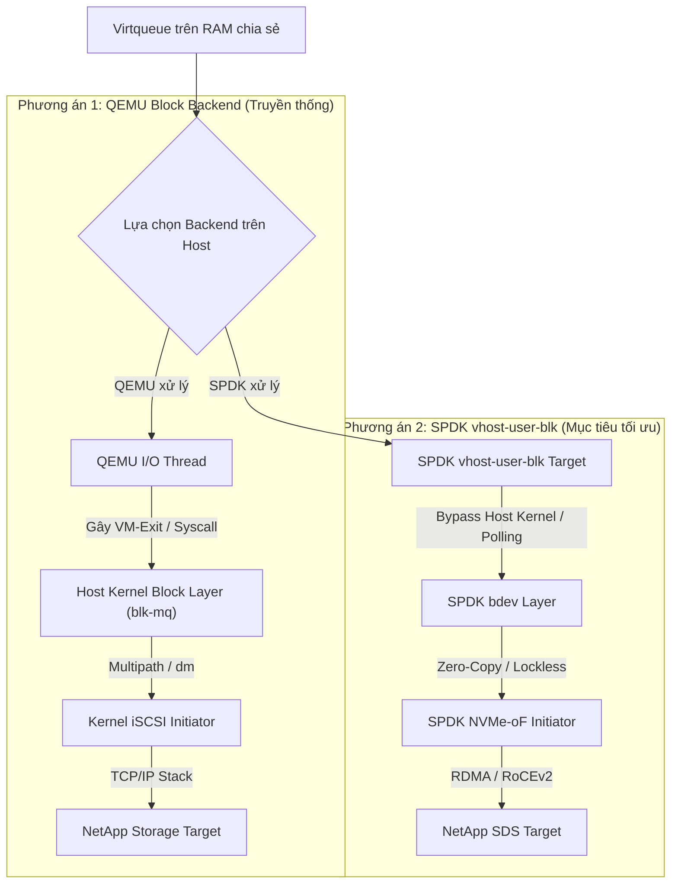
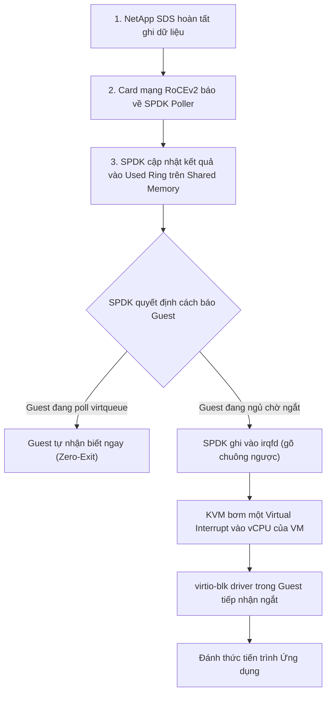

> **Mạch  nối tiếp:** 
> - **Bài 01:** Ứng dụng nhìn thấy gì (File, Filesystem, LBA) và các thước đo hiệu năng (IOPS, QD, Tail Latency).
> - **Bài 02:** Hành trình một I/O đi qua Linux Kernel (Syscall, `blk-mq`, DMA, Interrupt vs. Polling).
> - **Bài 03:** Dựng lên bức tường ảo hóa. Khi ứng dụng chạy trong **Guest VM** nhìn thấy ổ đĩa `/dev/vdb`, làm sao yêu cầu I/O có thể nhảy qua ranh giới máy ảo để sang **Compute Host**, và ai là người thực sự gánh vác việc xử lý dữ liệu?

## Mục lục
1. [[#Bảng thuật ngữ]]
2. [[#Nội dung kiến thức và kết quả cần đạt]]
3. [[#1. Bộ tứ quyền lực trong ảo hóa Linux: KVM, QEMU, libvirt và Guest OS]]
4. [[#2. Ảo ảnh /dev/vdb: Phân tách Frontend và Backend]]
5. [[#3. Virtio và Virtqueue: Ngôn ngữ chung giữa Guest và Host]]
6. [[#4. Ngã rẽ Backend: QEMU Block Engine vs. SPDK vhost-user-blk]]
7. [[#5. Bản chất Vhost-user: Unix Socket (Control) vs. Shared Memory (Data)]]
8. [[#6. Chiều hoàn tất (Completion): Đánh thức Guest VM như thế nào?]]
9. [[#7. Bản chất bộ nhớ chia sẻ: Shared Memory và vai trò thực tế của Hugepages]]
10. [[#8. Lắp ghép vào Job 1: Mắt xích OpenStack Cinder, Nova và os-brick]]
11. [[#9. Trả lời câu hỏi kiểm tra tư duy kiến trúc]]
12. [[#Tổng kết cốt lõi 80/20]]

---

## Bảng thuật ngữ

| Thuật ngữ | Hiểu ngắn gọn |
| :--- | :--- |
| **Hypervisor (VMM)** | Trình giám sát máy ảo, quản lý việc cấp phát CPU, RAM và thiết bị ngoại vi ảo cho các máy ảo. |
| **KVM (Kernel-based VM)** |Phân hệ trong Linux Kernel biến Linux thành Type-1 Hypervisor; tận dụng tập lệnh ảo hóa phần cứng của CPU (Intel VT-x / AMD-V) để thực thi mã máy ảo trực tiếp trên CPU vật lý. |
| **QEMU** | Tiến trình User-Space đóng vai trò mô phỏng phần cứng (bo mạch, bus PCI, cổng I/O, RAM) và điều phối vòng đời của VM. |
| **libvirt** | Thư viện và daemon nền tảng (`libvirtd`) chuẩn hóa API quản lý ảo hóa; nhận cấu hình XML để sinh lệnh điều khiển QEMU/KVM. |
| **Paravirtualization (Bán ảo hóa)** | Kỹ thuật ảo hóa trong đó Guest OS biết mình đang chạy trong môi trường ảo, chủ động cài driver chuyên dụng để giao tiếp tối ưu với Host thay vì giả lập phần cứng cũ. |
| **Virtio** | Chuẩn công nghiệp về giao tiếp bán ảo hóa (Paravirtualized I/O) trên Linux; định nghĩa cấu trúc truyền dữ liệu chung giữa Guest và Host. |
| **Virtqueue** | Cấu trúc dữ liệu hàng đợi vòng (Ring Buffer) trên RAM chia sẻ, dùng để chuyển tiếp các bản mô tả yêu cầu I/O (Descriptors) giữa Guest và Host. |
| **Frontend Driver** | Driver chạy trong Kernel của Guest VM (ví dụ `virtio-blk`, `virtio-net`) làm nhiệm vụ giao tiếp với hệ điều hành bên trong máy ảo. |
| **Backend Driver** | Thành phần chạy ở Host (QEMU hoặc SPDK) nhận và thực thi các yêu cầu I/O được đẩy ra từ Virtqueue. |
| **`vhost-user`** | Giao thức mở rộng của Virtio, cho phép chuyển toàn bộ Backend xử lý Virtqueue từ tiến trình QEMU sang một tiến trình User-Space độc lập bên ngoài (SPDK). |
| **VM-Exit** | Sự kiện CPU phần cứng tạm dừng thực thi mã trong máy ảo (Non-Root mode) để chuyển quyền điều khiển về cho Hypervisor ở Host (Root mode). Chi phí context switch phần cứng này rất đắt đỏ ($\approx 1 - 3\ \mu s$). |

---

## Nội dung kiến thức và kết quả cần đạt

Sau bài học này, bạn cần:
1. **Phân biệt rõ ràng vai trò và vị trí** của KVM, QEMU, libvirt và Guest OS trong kiến trúc ảo hóa.
2. **Hiểu rõ cơ chế Frontend - Backend**: Vì sao cùng một driver `virtio-blk` trong Guest mà phía Host lại có thể tráo đổi linh hoạt giữa QEMU và SPDK.
3. **Mô tả được cấu tạo của Virtqueue**: Descriptor Table, Available Ring và Used Ring.
4. **Phân định rạch ròi vai trò của Unix Domain Socket vs. Shared Memory** trong kiến trúc `vhost-user`.
5. **Hiểu đúng về Hugepages**: Phân biệt giữa yêu cầu "Bộ nhớ chia sẻ" (bắt buộc) và "Hugepages 1GB/2MB" (tùy chọn tối ưu hiệu năng).
6. **Làm chủ bức tranh Control Plane cho Job 1**: Biết chính xác Nova, Cinder và Libvirt phải tương tác với socket và XML như thế nào.

---

## 1. Bộ tứ quyền lực trong ảo hóa Linux: KVM, QEMU, libvirt và Guest OS

Trong một máy chủ Compute chạy OpenStack, 4 thành phần này phối hợp chặt chẽ với nhau nhưng đảm nhận 4 nhiệm vụ hoàn toàn độc lập:

```text
+-------------------------------------------------------------------------------+
| [OpenStack Nova / Cinder]                                                     |
|       │                                                                       |
|       ▼ (Tạo máy ảo bằng file XML)                                            |
| [libvirt (libvirtd)]          --> Người quản lý hồ sơ: Dịch XML thành lệnh    |
+-------│--------------------------- thực thi, điều phối vòng đời VM. ----------+
        │
        ▼ (Spawn tiến trình)
+----------------------------------- COMPUTE HOST ------------------------------+
| [Tiến trình QEMU (User Space)] --> Người vận hành: Cấp phát RAM, giả lập      |
|       │                            bus PCI, thiết lập kết nối vhost-user.     |
|       │                                                                       |
|       ├───────────────┐                                                       |
|       ▼ (ioctl)       ▼ (Mở socket)                                           |
| [Module KVM (Kernel)] [SPDK Target]                                           |
|  - Trọng tài CPU       - Backend I/O độc lập                                  |
|  - Intel VT-x/AMD-V    - Chạy polling ở User Space                            |
+-------│───────────────────────────────────────────────────────────────────────+
        │
        ▼ (Thực thi trực tiếp mã nhị phân trên CPU vật lý)
+──────────────────────────────── GUEST VM ─────────────────────────────────────+
| [Guest OS]                    --> Người thuê nhà: Nhìn thấy CPU, RAM, ổ đĩa   |
|  - App, Filesystem, virtio-blk     ảo /dev/vdb và hoàn toàn không biết mình   |
|                                    đang được ảo hóa bằng công nghệ gì.        |
+-------------------------------------------------------------------------------+

```

### Phân vai chi tiết:

- **libvirt (`libvirtd`):** Là lớp giao diện quản trị (Management Layer). Nó không tham gia vào luồng truyền dữ liệu (Data Plane) của từng I/O. Khi người dùng tạo VM trên OpenStack, Nova gửi một file đặc tả cấu hình XML cho libvirt. libvirt đọc XML, ráp các tham số lại rồi khởi chạy một tiến trình QEMU bằng một dòng lệnh Linux hoàn chỉnh.
- **QEMU (Quick Emulator):** Là một **tiến trình User-Space bình thường** trên Host. Nó tạo ra "bộ khung" của một cỗ máy vi tính: cấp phát một mảng bộ nhớ RAM ảo, dựng lên bảng cắm PCI ảo, giả lập card màn hình, BIOS/UEFI.
- **KVM (Kernel-based Virtual Machine):** Nếu QEMU phải giả lập từng lệnh CPU bằng phần mềm thì tốc độ sẽ cực kỳ chậm. KVM là module nhân Linux mở ra giao diện `/dev/kvm`. QEMU gọi vào KVM để giao nhiệm vụ: *"Hãy nạp các vCPU này lên các nhân CPU vật lý thật của chip Intel/AMD và cho nó chạy thẳng bằng tập lệnh phần cứng"*.
- **Guest OS:** Hệ điều hành cài bên trong máy ảo (Ubuntu, CentOS, Windows). Nó vận hành như trên một máy chủ vật lý: có bảng trang bộ nhớ riêng, quản lý tiến trình, nạp driver và phân vùng ổ đĩa.

> [!NOTE] Bản chất I/O không chạy tuần tự qua cả 4 lớp
> Một hiểu lầm tai hại là: *"Từng lệnh I/O phải đi từ Guest $\to$ KVM $\to$ QEMU $\to$ libvirt"*.
> **Thực tế:** libvirt hoàn toàn đứng ngoài khi VM đã chạy. Còn KVM chỉ can thiệp khi có sự kiện ngắt hoặc lỗi trang. Với giải pháp SPDK `vhost-user-blk`, dữ liệu I/O thậm chí **bỏ qua luôn cả KVM và QEMU** để chạy thẳng sang tiến trình SPDK.

---

## 2. Ảo ảnh `/dev/vdb`: Phân tách Frontend và Backend

Khi bạn ssh vào một máy ảo trên OpenStack và gõ lệnh `lsblk`, hệ thống báo ra:

```text
NAME   MAJ:MIN RM SIZE RO TYPE MOUNTPOINT
vda    252:0    0  20G  0 disk /
vdb    252:16   0 100G  0 disk /data

```

### Thiết bị `/dev/vdb` thực sự là gì?

Đây là một **khối thiết bị ảo (Paravirtualized Block Device)**. Trong mô hình ảo hóa hiện đại, một ổ đĩa luôn bị xé đôi làm 2 nửa:

```text
[ GUEST VM ]                     [ COMPUTE HOST ]
+-------------------------+      +-------------------------------------------+
| FRONTEND                |      | BACKEND (Nơi xử lý thật)                  |
| Driver virtio-blk       | ===> | Phương án 1: QEMU Block Engine (iSCSI/RAW)|
| Giao tiếp với Guest OS  |      | Phương án 2: SPDK vhost-user-blk (NVMe-oF)|
+-------------------------+      +-------------------------------------------+

```

1. **Frontend (Bên trong Guest VM):**
   - Là driver `virtio-blk` nằm trong nhân Linux của Guest.
   - Nhiệm vụ: Tiếp nhận lệnh đọc/ghi từ hệ thống tệp (`ext4/xfs`), đóng gói lại theo chuẩn giao tiếp chung Virtio, rồi ném vào hàng đợi **Virtqueue**.
   - **Đặc điểm:** Frontend hoàn toàn độc lập với hạ tầng bên dưới. Nó không quan tâm dữ liệu sẽ được lưu vào một file `.qcow2`, một LUN iSCSI hay một mảng đĩa NetApp NVMe-oF.

2. **Backend (Bên ngoài Compute Host):**
   - Là thành phần phần mềm lắng nghe ở đầu bên kia của Virtqueue.
   - Nhiệm vụ: Rút các yêu cầu I/O ra khỏi Virtqueue, đọc/ghi dữ liệu thực tế xuống thiết bị lưu trữ, sau đó đánh dấu hoàn tất.
   - **Sự linh hoạt:** Backend có thể là **QEMU** (phương án truyền thống) hoặc **SPDK** (phương án tối ưu hiệu năng).

> [!TIP] Kết luận quan trọng cho dự án
> Chuyển đổi hệ thống từ iSCSI truyền thống sang SPDK `vhost-user-blk` **chỉ là thay đổi Backend trên Compute Host**. Phía Guest VM vẫn sử dụng driver chuẩn `virtio-blk`, hệ thống tệp `ext4/xfs` và ứng dụng của khách hàng được giữ nguyên 100%, không cần cài thêm bất kỳ phần mềm hay driver tùy biến nào.

---

## 3. Virtio và Virtqueue: Ngôn ngữ chung giữa Guest và Host

Nếu mô phỏng lại một bộ điều khiển SATA hoặc IDE cổ điển, mỗi thao tác đọc/ghi đều bắt CPU phải thực hiện hàng loạt chỉ lệnh thanh ghi giả lập. Điều này gây ra hàng nghìn sự kiện **VM-Exit** (Guest bị dừng khựng lại để Host xử lý), khiến hiệu năng tụt dốc thảm hại.

**Virtio (Virtual I/O)** ra đời để giải quyết bài toán này: Guest và Host cùng thống nhất một cấu trúc bộ nhớ chia sẻ chung gọi là **Virtqueue**.

```text
                                VIRTQUEUE TRÊN RAM CHIA SẺ
========================================================================================
1. DESCRIPTOR TABLE (Mảng chứa con trỏ trỏ tới dữ liệu)
   +------+----------------------------------------------------------------------------+
   | ID 0 | Addr: 0x1000 (Header: Read, Sector 2048)  | Len: 16 B   | Flags: NEXT       |
   | ID 1 | Addr: 0x5000 (Data Buffer: Nơi chứa dữ liệu) | Len: 4096 B | Flags: WRITE, NEXT|
   | ID 2 | Addr: 0x2000 (Status: Ô ghi kết quả 0=OK) | Len: 1 B    | Flags: WRITE      |
   +------+----------------------------------------------------------------------------+

2. AVAILABLE RING (Guest nhắn Host: "Có việc mới ở các Descriptor này!")
   +-----------------------------------------------------------------------------------+
   | Index: 1  |  Danh sách Descriptor sẵn sàng xử lý: [ ID 0 ]                        |
   +-----------------------------------------------------------------------------------+

3. USED RING (Host nhắn Guest: "Việc ở các Descriptor này tôi đã làm xong!")
   +-----------------------------------------------------------------------------------+
   | Index: 1  |  Danh sách Descriptor đã hoàn tất:    [ ID 0, Len: 4096 ]             |
   +-----------------------------------------------------------------------------------+
========================================================================================

```

### Cấu trúc 3 thành phần của một Virtqueue (Split Virtqueue):

1. **Descriptor Table (Bảng mô tả vùng nhớ):**
   - Không chứa trực tiếp dữ liệu I/O (tránh tốn bộ nhớ).
   - Nó chứa các con trỏ: Địa chỉ vùng nhớ RAM (`addr`), độ dài (`len`), và các cờ (`flags`).
   - Một lệnh I/O thường là một chuỗi liên kết (Chained Descriptors): *Descriptor 1 (Chứa thông tin lệnh) $\to$ Descriptor 2 (Vùng đệm chứa dữ liệu) $\to$ Descriptor 3 (Ô nhớ để ghi trạng thái thành công/thất bại)*.

2. **Available Ring (Vòng việc chờ làm - Do Guest ghi, Host đọc):**
   - Là một mảng vòng tròn chứa các chỉ số (ID) của chuỗi Descriptor mà Guest đã chuẩn bị xong và sẵn sàng bàn giao cho Host xử lý.

3. **Used Ring (Vòng việc đã xong - Do Host ghi, Guest đọc):**
   - Là một mảng vòng tròn chứa các chỉ số Descriptor mà Backend trên Host đã xử lý xong và bàn giao ngược lại cho Guest để báo cáo hoàn thành.

---

## 4. Ngã rẽ Backend: QEMU Block Engine vs. SPDK vhost-user-blk

Khi Guest VM đẩy một chỉ số vào `Available Ring`, điều gì sẽ xảy ra tiếp theo trên Compute Host?



### So sánh chi tiết hai con đường:

#### Phương án 1: QEMU Block Backend (Datapath truyền thống)

1. Guest VM ghi vào Virtqueue rồi gõ chuông ảo (**Virtual Doorbell**) bằng lệnh ghi vào cổng I/O.
2. Thao tác này kích hoạt một sự kiện **VM-Exit**: CPU vật lý dừng thực thi vCPU, chuyển quyền điều khiển về KVM trong Host Kernel.
3. KVM gửi tín hiệu (`eventfd`) để đánh thức tiến trình QEMU (hoặc một `IOThread` của QEMU) ở User-Space.
4. QEMU đọc Virtqueue, giải mã yêu cầu rồi gọi các **System Call** (như `preadv/pwritev`, Linux AIO, hoặc io_uring) vào Host Kernel.
5. Host Kernel tiếp tục định tuyến yêu cầu qua Device Mapper, Multipath, đóng gói thành gói tin iSCSI qua driver TCP/IP của nhân Linux để gửi tới NetApp.

- **Hậu quả:** Chi phí chuyển đổi ngữ cảnh quá dày đặc (Guest $\to$ KVM $\to$ QEMU $\to$ Host Kernel), tranh chấp khóa CPU, gây biến động độ trễ và đẩy Tail Latency P99 lên rất cao.

#### Phương án 2: SPDK `vhost-user-blk` (Datapath siêu tốc)

1. Guest VM điền thông tin vào Virtqueue trên vùng nhớ chia sẻ (**Shared Memory**).
2. SPDK vhost target chạy trên Compute Host dưới dạng một tiến trình độc lập. Một worker core của SPDK được gán cứng (CPU Pinning) chạy cơ chế **Polling (PMD)** liên tục kiểm tra `Available Ring`.
3. Khi phát hiện có Descriptor mới, **SPDK lập tức bốc việc ra xử lý mà không cần chờ chuông Doorbell, không gây ra bất kỳ sự kiện VM-Exit nào, và hoàn toàn không gọi System Call vào Host Kernel**.
4. SPDK chuyển yêu cầu thành cấu trúc lệnh nội bộ `spdk_bdev_io`, đẩy thẳng xuống **SPDK NVMe-oF Initiator**.
5. Card mạng Mellanox sử dụng cơ chế RDMA (RoCEv2) để đọc thẳng dữ liệu từ RAM của VM bắn qua switch sang tủ NetApp SDS với độ trễ tối thiểu.

---

## 5. Bản chất Vhost-user: Unix Socket (Control) vs. Shared Memory (Data)

Để triển khai được Job 1, bạn bắt buộc phải phân biệt được hai kênh truyền hoàn toàn tách biệt trong giao thức `vhost-user`:

```text
+───────────────────────────────────────────────────────────────────────────────+
| [1. CONTROL PLANE: Giao tiếp qua UNIX DOMAIN SOCKET]                          |
|                                                                               |
|   QEMU (libvirt sinh)  <====== /var/run/spdk/vhost.sock ======>  SPDK Target  |
|                                                                               |
|   - Bắt tay (Handshake) thương lượng tính năng (VHOST_USER_SET_FEATURES).     |
|   - Đồng bộ số lượng Virtqueue, độ sâu hàng đợi.                              |
|   - TRUYỀN FILE DESCRIPTOR (FD) CỦA VÙNG NHỚ RAM QUA SCM_RIGHTS:              |
|     QEMU gửi các File Descriptors đại diện cho các vùng RAM/Hugepages của     |
|     Guest VM sang cho SPDK.                                                   |
+───────────────────────────────────────────────────────────────────────────────+
                                        │
                                        ▼ (SPDK gọi lệnh mmap(fd))
+───────────────────────────────────────────────────────────────────────────────+
| [2. DATA PLANE: Truyền dữ liệu qua BỘ NHỚ CHIA SẺ (SHARED MEMORY)]            |
|                                                                               |
|   GUEST VM RAM  <════════════════════════════════════════════>  SPDK POLLER   |
|   (Hugepages 2MB/1GB)                                           (Lockless)    |
|                                                                               |
|   - Dữ liệu I/O và các Descriptor chạy trực tiếp trên các ô nhớ vật lý này.   |
|   - TUYỆT ĐỐI KHÔNG CÓ DỮ LIỆU I/O NÀO CHẠY QUA FILE SOCKET UNIX!             |
+───────────────────────────────────────────────────────────────────────────────+

```

### 1. Kênh Điều khiển (Control Plane - Unix Domain Socket):

- Là một file socket nằm trên hệ thống tệp của Host (ví dụ `/var/run/spdk/vhost-blk-vdb.sock`).
- Chỉ hoạt động khi khởi tạo, cấu hình hoặc ngắt kết nối VM.
- **Cơ chế truyền FD (`SCM_RIGHTS`):** Trong Linux, một tiến trình không thể tự ý đọc RAM của tiến trình khác. Để cho phép SPDK đọc được RAM của VM, QEMU gửi chính các File Descriptor quản lý bộ nhớ của VM qua Unix Socket bằng cấu trúc điều khiển `SCM_RIGHTS`. Nhờ vậy, SPDK gọi hàm `mmap()` trên các FD này và "nhìn thấy" toàn bộ không gian RAM của VM như thể là RAM của chính nó.

### 2. Kênh Dữ liệu (Data Plane - Shared Memory):

- Khi giai đoạn bắt tay hoàn tất, Unix Socket hoàn toàn "ngủ yên".
- Toàn bộ các thao tác trao đổi `Available Ring`, `Used Ring` và các khối dữ liệu đọc/ghi 4 KiB/64 KiB đều diễn ra trực tiếp trên các thanh RAM vật lý chung. Băng thông truyền lúc này đạt tốc độ tối đa của bus bộ nhớ máy tính.

---

## 6. Chiều hoàn tất (Completion): Đánh thức Guest VM như thế nào?

Một chu trình I/O chỉ kết thúc khi ứng dụng trong máy ảo nhận được tín hiệu: *"Dữ liệu đã ghi xong"*. Khi SPDK hoàn thành việc ghi dữ liệu xuống NetApp, luồng tín hiệu báo về sẽ đi theo con đường nào?



### Giải mã nghịch lý: "SPDK Polling nhưng Guest vẫn nhận Interrupt"

- Ở tầng Host: SPDK dùng cơ chế **Polling (PMD)** để hỏi card mạng và hoàn thành lệnh cực nhanh mà không bị trễ ngắt Host.
- Nhưng ở tầng Guest: Nếu ứng dụng trong Guest VM đang ở trạng thái ngủ chờ kết quả (Blocking I/O), vCPU của VM phải được đánh thức.
- SPDK sẽ ghi một tín hiệu vào một cơ chế gọi là **`irqfd`** (Event File Descriptor liên kết với KVM). KVM ngay lập tức tiêm (inject) một **ngắt ảo (Virtual Interrupt)** vào vCPU tương ứng của máy ảo.
- **Kết luận:** Polling ở Host giúp triệt tiêu biến động độ trễ ở tầng Compute, nhưng nó **không xóa bỏ cơ chế ngắt bên trong Guest OS**. Latency mà ứng dụng đo được trong VM là tổng thời gian từ lúc Guest phát lệnh $\to$ SPDK xử lý $\to$ và Guest nhận lại ngắt ảo.

---

## 7. Bản chất bộ nhớ chia sẻ: Shared Memory và vai trò thực tế của Hugepages

Khi tìm hiểu về `vhost-user`, bạn sẽ thường thấy tài liệu nhắc đến **Hugepages**. Cần bóc tách rõ hai khái niệm này để tránh nhầm lẫn kiến trúc:

```text
                YÊU CẦU BẮT BUỘC: SHARED MEMORY (Bộ nhớ chia sẻ)
          (Để QEMU và SPDK cùng nhìn thấy chung một không gian RAM)
                                    │
                                    ├──> Cách 1: Shared Anonymous Memory (memfd)
                                    │
                                    └──> Cách 2: HUGEPAGES (Bộ nhớ trang lớn)
                                                 │
                                                 ├──> 2 MiB Hugepages
                                                 └──> 1 GiB Hugepages

```

### 1. Shared Memory là điều kiện CẦN:

- Để giao thức `vhost-user` hoạt động, **bắt buộc bộ nhớ của máy ảo phải được cấu hình ở chế độ chia sẻ (`share=on`)**.
- Nếu bạn khởi tạo VM bằng RAM tiêu chuẩn không chia sẻ, QEMU không thể sinh ra File Descriptor để chia sẻ cho SPDK qua socket $\to$ SPDK target sẽ lập tức báo lỗi và từ chối kết nối.

### 2. Hugepages là giải pháp TỐI ƯU HIỆU NĂNG:

- Mặc định, Linux quản lý bộ nhớ bằng các trang nhỏ kích thước **4 KiB**.
- Với một VM có 64 GiB RAM, hệ thống phải quản lý tới **16 triệu trang nhớ**. Bộ đệm dịch địa chỉ của CPU (**TLB - Translation Lookaside Buffer**) chỉ chứa được vài nghìn mục, dẫn đến tình trạng **TLB Miss liên tục**, bắt CPU phải tốn thời gian tra cứu bảng trang.
- **Giải pháp Hugepages:**
   - Gom các trang nhỏ thành các khối lớn: **2 MiB** hoặc **1 GiB**.
   - Một VM 64 GiB RAM nếu dùng trang 1 GiB thì chỉ cần đúng **64 mục quản lý trong TLB**, tỉ lệ TLB Miss giảm về gần bằng 0.
   - Giúp các thiết bị ngoại vi và SPDK thực hiện ánh xạ DMA nhanh chóng, ổn định hóa Tail Latency P99 khi truyền tải lưu lượng dữ liệu khổng lồ.

> [!WARNING] Cảnh báo hiểu sai: "vhost-user bắt buộc phải dùng Hugepages 1 GiB"?
> **Không đúng.** Về mặt kỹ thuật, `vhost-user` chỉ yêu cầu **Shared Memory**. Bạn hoàn toàn có thể chạy `vhost-user` với cơ chế `memfd` (bộ nhớ ảo tiêu chuẩn không cần cấp phát trước Hugepages) hoặc Hugepages loại 2 MiB trong môi trường thử nghiệm (Lab). Tuy nhiên, trên môi trường Production yêu cầu hiệu năng cao của Telco/Cloud, **Hugepages (2 MiB hoặc 1 GiB) là khuyến nghị bắt buộc** để triệt tiêu hiện tượng thắt cổ chai bộ nhớ.

---

## 8. Lắp ghép vào Job 1: Mắt xích OpenStack Cinder, Nova và os-brick

Hiểu toàn bộ lý thuyết trên sẽ giúp bạn thấy rõ bức tranh lập trình Control Plane trong **Job 1**:

```text
[ Người dùng / Horizon / CLI ]
             │ (Yêu cầu: Gắn Volume 'vol-xyz' vào Máy ảo 'vm-01')
             ▼
[ OpenStack CINDER ]
  - Quản trị vòng đời Storage Volume trên NetApp.
  - Cung cấp thông số kết nối: NQN, Target IP, Port, Subsystem.
             │
             ▼ (Gửi Connection Info)
[ OpenStack NOVA (Compute Host) ]
             │
             ▼ (Gọi thư viện kết nối)
[ Custom os-brick (Phần việc code của bạn) ]
  1. Giao tiếp với SPDK Daemon:
     Bắn lệnh JSON-RPC `bdev_nvme_attach_controller` (kết nối NetApp).
  2. Tạo vhost device:
     Bắn lệnh JSON-RPC `vhost_create_blk_controller -u /var/run/spdk/vhost-vol-xyz.sock`.
  3. Trả về thông tin Socket File cho Nova.
             │
             ▼
[ libvirt Driver (Nova Compute) ]
  - Sinh thẻ XML mô tả thiết bị đĩa vhost-user.
  - Gọi libvirt API để gắn (Attach) nóng ổ đĩa vào máy ảo.

```

### Cấu hình Libvirt Domain XML cần đạt được:

Để QEMU kết nối đúng vào SPDK socket mà code của bạn đã tạo, file XML của máy ảo phải có cấu trúc chuẩn như sau:

```xml
<disk type='vhostuser' device='disk'>
  <driver name='qemu' type='raw'/>
  <!-- Chỉ định file Unix Domain Socket do SPDK tạo ra -->
  <source type='unix' path='/var/run/spdk/vhost-vol-xyz.sock'>
    <reconnect enabled='yes' timeout='10'/>
  </source>
  <!-- Thiết bị đích hiển thị bên trong Guest VM -->
  <target dev='vdb' bus='virtio'/>
  <address type='pci' domain='0x0000' bus='0x00' slot='0x05' function='0x0'/>
</disk>

```

Đồng thời, cấu hình bộ nhớ của VM trong Libvirt bắt buộc phải khai báo chia sẻ:

```xml
<memoryBacking>
  <hugepages>
    <page size='2048' unit='KiB'/> <!-- Hoặc 1 GiB -->
  </hugepages>
  <source type='memfd'/>
  <access mode='shared'/> <!-- BẮT BUỘC: Cho phép SPDK truy cập chung RAM -->
</memoryBacking>

```

---

## 9. Trả lời câu hỏi kiểm tra tư duy kiến trúc

> **Câu hỏi:** *Nếu SPDK vhost target đã tạo socket (`vhost.sock`) và bdev thành công, nhưng VM chưa được cấu hình kết nối tới socket đó, thì Guest VM đã có thể nhìn thấy và sử dụng ổ đĩa SPDK chưa? Vì sao?*

### Phân tích và kết luận:

**Guest VM TUYỆT ĐỐI CHƯA THỂ nhìn thấy hay sử dụng ổ đĩa này.**

**Vì sao?**

1. **Thiếu liên kết phần cứng ảo:**
Trong mô hình ảo hóa, Guest VM không tự quét tìm trên mạng hay trên Host xem có socket nào đang rảnh rỗi. Guest chỉ nhận diện thiết bị thông qua **Bus PCI ảo** do QEMU mô phỏng. Khi QEMU chưa được cấu hình thẻ `<disk type='vhostuser'>`, QEMU sẽ không cắm thêm một chân thiết bị PCI ảo mới vào bo mạch chủ của máy ảo.
2. **Kênh Control Plane chưa được thiết lập:**
Tiến trình SPDK và QEMU chưa thực hiện bước bắt tay (Handshake) qua Unix socket. QEMU chưa gửi File Descriptor của vùng nhớ RAM Guest sang cho SPDK $\to$ SPDK hoàn toàn không có quyền truy cập vào bộ nhớ của VM để đọc/ghi Virtqueue.
3. **Frontend chưa được kích hoạt:**
Do không có thiết bị PCI ảo xuất hiện trên bus, nhân Linux của Guest (`virtio-blk` driver) không nhận được tín hiệu cắm nóng thiết bị (PCI Hotplug event), không khởi tạo Virtqueue, và không bao giờ sinh ra file thiết bị `/dev/vdb`.

---

## Tổng kết cốt lõi 80/20

1. **Ảo hóa phân tách rõ ràng:** `libvirt` quản lý cấu hình, `QEMU` điều phối máy ảo và cấp RAM, `KVM` tăng tốc thực thi CPU bằng phần cứng, và `Guest OS` là môi trường chạy ứng dụng độc lập.
2. **Frontend và Backend độc lập:** Guest luôn dùng driver `virtio-blk` để giao tiếp với Virtqueue; Backend trên Host có thể linh hoạt chọn QEMU hoặc SPDK mà không ảnh hưởng tới Guest.
3. **Virtqueue là bảng giao việc trên RAM:** Gồm Descriptor Table (con trỏ địa chỉ), Available Ring (việc cần làm do Guest phát), và Used Ring (việc đã xong do Host trả).
4. **Phân biệt hai kênh của Vhost-user:**
   - **Unix Socket:** Chỉ dùng ở tầng **Control Plane** để bắt tay cấu hình và chuyển giao File Descriptor của vùng nhớ RAM.
   - **Shared Memory:** Đảm nhận toàn bộ **Data Plane**, cho phép truyền nhận dữ liệu I/O trực tiếp ở tốc độ bộ nhớ vật lý.

5. **SPDK Polling ở Host không triệt tiêu ngắt ở Guest:** SPDK poll để dập tắt biến động trễ ở Compute, sau đó dùng `irqfd` tiêm ngắt ảo để báo cho Guest VM hoàn thành.
6. **Shared Memory là bắt buộc, Hugepages là tối ưu:** Muốn chạy `vhost-user` bắt buộc phải bật bộ nhớ chia sẻ (`share=on`); còn Hugepages (2MB/1GB) giúp loại bỏ TLB Miss để giữ đường cong Tail Latency P99 luôn phẳng.

