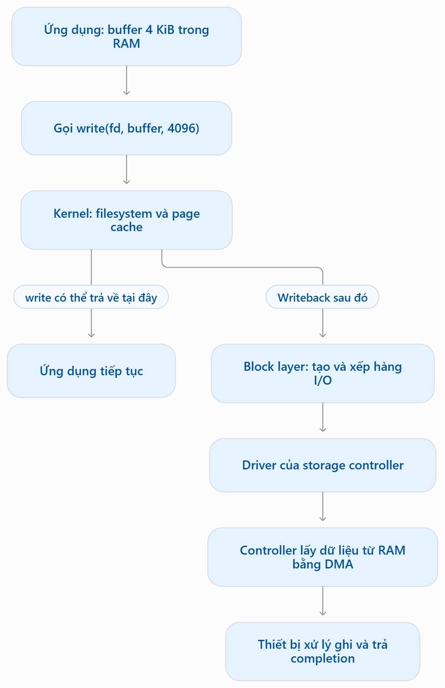
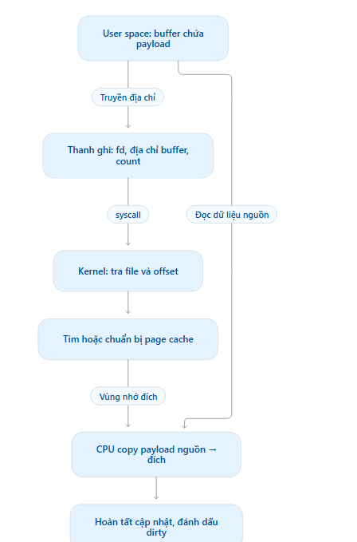

# Host-write vs VM-write: khái niệm và đường đi của một lần write()

## Mục lục

- [Các khái niệm](#các-khái-niệm)
  - [TẦNG 1: GUEST OS (Ảo hóa thiết bị)](#tầng-1-guest-os-ảo-hóa-thiết-bị)
    - [1. virtio-blk vs virtio-scsi](#1-virtio-blk-vs-virtio-scsi)
  - [TẦNG 2: USERSPACE TRÊN HOST (Tiến trình QEMU & Daemons)](#tầng-2-userspace-trên-host-tiến-trình-qemu--daemons)
    - [1. QEMU AioContext, IOthread và Multi IOthread](#1-qemu-aiocontext-iothread-và-multi-iothread)
    - [2. iscsid (Tách bạch Control Plane vs Data Plane)](#2-iscsid-tách-bạch-control-plane-vs-data-plane)
  - [TẦNG 3: KERNEL SPACE TRÊN HOST (Storage Stack & Modules)](#tầng-3-kernel-space-trên-host-storage-stack--modules)
    - [1. Ba bộ module cốt lõi của Linux Kernel iSCSI](#1-ba-bộ-module-cốt-lõi-của-linux-kernel-iscsi)
    - [2. SCSI Subsystem & dm-multipath](#2-scsi-subsystem--dm-multipath)
    - [3. vhost IO (vhost-blk / vhost-scsi trong Kernel)](#3-vhost-io-vhost-blk--vhost-scsi-trong-kernel)
  - [TẦNG 4: HARDWARE & BỘ NHỚ VẬT LÝ (Dòng chảy phần cứng)](#tầng-4-hardware--bộ-nhớ-vật-lý-dòng-chảy-phần-cứng)
    - [1. Phân biệt MMU vs IOMMU](#1-phân-biệt-mmu-vs-iommu)
    - [2. DMA (Direct Memory Access)](#2-dma-direct-memory-access)
    - [3. Storage Controllers: Host Controller (HBA) vs Disk Controller](#3-storage-controllers-host-controller-hba-vs-disk-controller)
    - [4. rDMA (Remote Direct Memory Access) & Cấu trúc định danh](#4-rdma-remote-direct-memory-access--cấu-trúc-định-danh)
- [write host](#write-host)
  - [Bước 1 — Ứng dụng chuẩn bị dữ liệu trong RAM](#bước-1--ứng-dụng-chuẩn-bị-dữ-liệu-trong-ram)
  - [Bước 2 — Ứng dụng gọi write()](#bước-2--ứng-dụng-gọi-write)
  - [Bước 3 — Kernel đưa dữ liệu vào page cache](#bước-3--kernel-đưa-dữ-liệu-vào-page-cache)
  - [Bước 4 — Kernel thực hiện writeback](#bước-4--kernel-thực-hiện-writeback)
  - [Bước 5 — Block layer và driver chuẩn bị lệnh](#bước-5--block-layer-và-driver-chuẩn-bị-lệnh)
  - [Bước 6 — Controller lấy payload từ RAM bằng DMA](#bước-6--controller-lấy-payload-từ-ram-bằng-dma)
  - [Bước 7 — Thiết bị báo hoàn thành](#bước-7--thiết-bị-báo-hoàn-thành)
- [Phân tích chi tiết từng bước](#phân-tích-chi-tiết-từng-bước)
  - [Buffer ứng dụng — RAM](#buffer-ứng-dụng--ram)
    - [1. Chuẩn bị Buffer tại User Space & Bản chất Bộ nhớ](#1-chuẩn-bị-buffer-tại-user-space--bản-chất-bộ-nhớ)
    - [2. Thiết lập ABI & Nạp Thanh ghi x86-64 trước Syscall](#2-thiết-lập-abi--nạp-thanh-ghi-x86-64-trước-syscall)
    - [3. Chỉ lệnh syscall: Bẻ hướng thực thi và Đổi quyền Ring 3 → Ring 0](#3-chỉ-lệnh-syscall-bẻ-hướng-thực-thi-và-đổi-quyền-ring-3--ring-0)
    - [4. Định tuyến qua VFS: Tra cứu File Descriptor và Offset](#4-định-tuyến-qua-vfs-tra-cứu-file-descriptor-và-offset)
    - [5. Chuẩn bị vùng đích trong Page Cache (Folio / Page Allocation)](#5-chuẩn-bị-vùng-đích-trong-page-cache-folio--page-allocation)
    - [6. Sao chép Payload bằng Kernel Helper uaccess (Lần memcpy đầu tiên)](#6-sao-chép-payload-bằng-kernel-helper-uaccess-lần-memcpy-đầu-tiên)
    - [7. Đánh dấu Dirty, Cập nhật Metadata và Trả quyền qua sysretq](#7-đánh-dấu-dirty-cập-nhật-metadata-và-trả-quyền-qua-sysretq)
  - [BƯỚC 4: KERNEL WRITEBACK & FILESYSTEM MAPPING](#bước-4-kernel-writeback--filesystem-mapping)
    - [4.1. Cơ chế kích hoạt Writeback (Ai đánh thức? Lúc nào xả?)](#41-cơ-chế-kích-hoạt-writeback-ai-đánh-thức-lúc-nào-xả)
    - [4.2. Khóa trạng thái Folio/Page](#42-khóa-trạng-thái-foliopage)
    - [4.3. Filesystem Block Mapping (Dịch File Offset → LBA logic)](#43-filesystem-block-mapping-dịch-file-offset--lba-logic)
    - [4.4. Khởi tạo cấu trúc struct bio (Block I/O)](#44-khởi-tạo-cấu-trúc-struct-bio-block-io)
  - [BƯỚC 5: BLOCK LAYER (blk-mq) & DRIVER CHUẨN BỊ LỆNH](#bước-5-block-layer-blk-mq--driver-chuẩn-bị-lệnh)
    - [5.1. Chuyển bio thành struct request & I/O Merging](#51-chuyển-bio-thành-struct-request--io-merging)
    - [5.2. Điều phối qua kiến trúc đa hàng đợi blk-mq](#52-điều-phối-qua-kiến-trúc-đa-hàng-đợi-blk-mq)
    - [5.3. Driver tiếp nhận & Thiết lập DMA Mapping](#53-driver-tiếp-nhận--thiết-lập-dma-mapping)
    - [5.4. Xây dựng Hardware Command Descriptor (NVMe SQE)](#54-xây-dựng-hardware-command-descriptor-nvme-sqe)
  - [BƯỚC 6: CONTROLLER TRUY XUẤT DMA & HOÀN TẤT](#bước-6-controller-truy-xuất-dma--hoàn-tất)
    - [6.1. Gõ chuông Doorbell (Host báo Controller)](#61-gõ-chuông-doorbell-host-báo-controller)
    - [6.2. Controller Fetch Command (Lấy lệnh về ASIC)](#62-controller-fetch-command-lấy-lệnh-về-asic)
    - [6.3. Controller DMA Payload (Kéo 4 KiB từ Page Cache)](#63-controller-dma-payload-kéo-4-kib-từ-page-cache)
    - [6.4. Ghi xuống Media và Tạo Completion (CQE)](#64-ghi-xuống-media-và-tạo-completion-cqe)
    - [6.5. Báo ngắt và Dọn dẹp trạng thái Kernel](#65-báo-ngắt-và-dọn-dẹp-trạng-thái-kernel)
  - [BẢNG ĐỐI CHIẾU TRẠNG THÁI & BẢN CHẤT DỮ LIỆU QUA 3 BƯỚC](#bảng-đối-chiếu-trạng-thái--bản-chất-dữ-liệu-qua-3-bước)

---

## Các khái niệm

Hệ thống lý thuyết dưới đây được bóc tách theo đúng 4 tầng kiến trúc (từ **Guest** → **Userspace Host** → **Kernel Host** → **Phần cứng**), bám sát mục tiêu của bài lab: **đo đạc, bóc tách cơ chế chuyển đổi địa chỉ (VA/PA), số lần sao chép (`memcpy`), và xác định nguồn gốc overhead giữa luồng Host-write và VM-write.**

### TẦNG 1: GUEST OS (Ảo hóa thiết bị)

#### 1. virtio-blk vs virtio-scsi

- `virtio-blk` **(Paravirtualized Block Device):**
  - **Bản chất:** Trình bày thiết bị cho Guest dưới dạng một ổ đĩa khối thuần túy (`/dev/vdb`).
  - , đó
  - **Cơ chế:** Driver trong Guest nhận I/Ong gói thành cấu trúc Virtio request đơn giản (Header, Data Buffer, Status) rồi đẩy thẳng vào **Virtqueue**.
  - **Ưu/Nhược điểm:** Cực kỳ tinh gọn, path thực thi ngắn, overhead thấp nhất. Tuy nhiên, nó **không hỗ trợ các tập lệnh SCSI nâng cao** (không pass-through được SCSI CDB, không hỗ trợ SCSI Persistent Reservation cho clustering).
- `virtio-scsi` **(Paravirtualized SCSI Controller):**
  - **Bản chất:** Trình bày cho Guest một bộ điều khiển SCSI ảo (`SCSI HBA`), các ổ đĩa bên dưới xuất hiện dưới dạng SCSI LUN (`/dev/sdb`, `/dev/sdc`).
  - **Cơ chế:** Cho phép Guest đóng gói nguyên vẹn khung lệnh **SCSI CDB (Command Descriptor Block)** gửi xuống Host.
  - **Ưu/Nhược điểm:** Cho phép pass-through toàn bộ tính năng SCSI (TRIM/UNMAP, mã định danh WWN, quản lý hàng trăm LUN chỉ với 1 controller ảo trên PCI bus). Đổi lại, path xử lý dài hơn và tốn CPU hơn `virtio-blk` do phải giải mã thêm tầng SCSI trong Guest.

### TẦNG 2: USERSPACE TRÊN HOST (Tiến trình QEMU & Daemons)

#### 1. QEMU AioContext, IOthread và Multi IOthread

- `AioContext`:
  - Là cấu trúc **vòng lặp sự kiện bất đồng bộ (Event Loop)** cốt lõi bên trong QEMU.
  - Nó quản lý: các file descriptor cần theo dõi (`epoll`), bộ đếm thời gian (timers), và các tác vụ trì hoãn (Bottom Halves - BH). Mọi thao tác I/O bất đồng bộ của QEMU đều phải gắn vào một `AioContext`.
- `IOthread` **(Tách khỏi Big QEMU Lock):**
  - Mặc định, QEMU xử lý I/O trên luồng chính (**Main Event Loop**). Luồng này bị trói bởi **BQL (Big QEMU Lock)**. Khi vCPU phát I/O, nó phải cạnh tranh BQL với các tác vụ đồ họa, quản trị, mạng ảo, gây nghẽn cổ chai nghiêm trọng.
  - Cấu hình `object iothread`: QEMU sẽ spawn một `pthread` riêng biệt chạy một `AioContext` độc lập, **hoàn toàn thoát khỏi BQL**. Luồng này chuyên trách việc đón nhận và xử lý Virtqueue của đĩa ảo.
- `Multi IOthread`:
  - Gán nhiều IOthread cho các đĩa khác nhau, hoặc kết hợp với tính năng `num-queues` của `virtio-blk` (mỗi hàng đợi Virtqueue được phục vụ bởi một IOthread riêng trên các CPU Core khác nhau). Giúp phân tán tải I/O trên hệ thống nhiều Core, chống nghẽn đơn luồng.

#### 2. iscsid (Tách bạch Control Plane vs Data Plane)

- **Bản chất:** Là tiến trình dịch vụ User Space thuộc bộ công cụ `open-iscsi`.
- **Ranh giới quan trọng cần nhớ:**
  - `iscsid` **chỉ chịu trách nhiệm Control Plane**: Dò tìm target (Discovery), xác thực (CHAP), đàm phán tham số phiên (Login/Session Negotiation qua Netlink socket với Kernel).
  - Khi phiên iSCSI đã chuyển sang trạng thái `LOGGED_IN`, `iscsid` **hoàn toàn đứng ngoài luồng I/O**. Toàn bộ Data Plane (đọc/ghi block) được đẩy trực tiếp xuống Kernel driver (`iscsi_tcp.ko`).

### TẦNG 3: KERNEL SPACE TRÊN HOST (Storage Stack & Modules)

#### 1. Ba bộ module cốt lõi của Linux Kernel iSCSI

Nhân Linux chia việc xử lý iSCSI thành 3 module xếp tầng:

1. `scsi_transport_iscsi.ko` **(Transport Class):** Cung cấp giao diện sysfs (`/sys/class/iscsi_transport`), quản lý thuộc tính phiên và đóng vai trò cầu nối IPC (qua Netlink) giữa Kernel và daemon `iscsid` ở User Space.
2. `libiscsi.ko` **(Protocol Engine):** Thư viện dùng chung chứa toàn bộ logic của giao thức iSCSI: quản lý hàng đợi lệnh, đánh số thứ tự (CmdSN, StatSN), đóng/mở gói PDU (Protocol Data Unit), xử lý lỗi timeout và truyền lại.
3. **Driver vận chuyển cụ thể (Data Plane Transport):**
   - `iscsi_tcp.ko`: Driver phổ biến nhất, chịu trách nhiệm chuyển đổi iSCSI PDU thành các luồng dữ liệu chạy qua socket TCP/IP chuẩn của Kernel.
   - *(Nếu dùng RDMA sẽ là `iser.ko` - iSCSI Extensions for RDMA).*

#### 2. SCSI Subsystem & dm-multipath

- **SCSI Subsystem (Kiến trúc 3 lớp):**
  - *Upper Layer (`sd_mod`):* Nhận `struct bio` từ Block Layer, quản lý thiết bị đĩa (`/dev/sda`), sinh lệnh SCSI
  - *Middle Layer (`scsi_mod`):* Định tuyến lệnh, cấp phát Command Tag, quản lý hàng đợi và cơ chế phục hồi lỗi (Error Handler).
  - *Lower Layer (LLD):* Driver phần cứng thực sự giao tiếp với dây cáp (ở đây `iscsi_tcp` đóng vai trò là một LLD ảo).
- `dm-multipath` **(`dm_multipath.ko`):**
  - Nằm trong phân hệ Device Mapper. Nó gom nhiều đường dẫn vật lý (ví dụ: Target có 2 IP tương ứng với `/dev/sda` và `/dev/sdb`) thành một thiết bị ảo thống nhất: `/dev/mapper/mpathX`.
  - Điều phối I/O theo chính sách (Round-Robin, Queue-Length, Service-Time) và tự động chuyển đường (Failover) khi một card mạng hoặc switch bị đứt.

#### 3. vhost IO (vhost-blk / vhost-scsi trong Kernel)

- Khác với QEMU thông thường (xử lý Virtqueue ở User Space), phân hệ `vhost` trong Linux Kernel (`vhost.ko`) chuyển việc xử lý Virtqueue **trực tiếp vào nhân Linux**.
- Khi Guest gõ Doorbell, kernel host đón bắt sự kiện và gọi trực tiếp `vhost_worker` (một kthread) bốc Descriptor từ RAM của Guest nạp thẳng vào Block Layer của Host, **loại bỏ bước chuyển ngữ cảnh sang tiến trình QEMU**.

### TẦNG 4: HARDWARE & BỘ NHỚ VẬT LÝ (Dòng chảy phần cứng)

#### 1. Phân biệt MMU vs IOMMU

- `MMU` **(Memory Management Unit):**
  - Nằm bên trong CPU.
  - Nhiệm vụ: Dịch địa chỉ ảo của ứng dụng (**VA - Virtual Address**) sang địa chỉ vật lý của RAM (**PA - Physical Address**) thông qua bảng phân trang (Page Table Walk).
  - Trong ảo hóa (KVM), MMU hỗ trợ cơ chế phân trang hai lớp (**EPT - Extended Page Tables**): dịch từ *Guest VA* → *Guest PA* → *Host PA*.
- `IOMMU` **(I/O Memory Management Unit - Intel VT-d / AMD-Vi):**
  - Nằm trên bo mạch chủ / PCIe Root Complex, phục vụ riêng cho **thiết bị ngoại vi**.
  - Nhiệm vụ: Dịch địa chỉ ảo của thiết bị (**IOVA / DMA Address**) sang địa chỉ vật lý thật (**Host PA**).
  - Vai trò: Ngăn thiết bị ngoại vi ghi đè bừa bãi vào vùng nhớ Kernel, và là điều kiện bắt buộc để thực hiện gán thẳng thiết bị (PCIe Passthrough) vào máy ảo.

#### 2. DMA (Direct Memory Access)

- Là cơ chế cho phép Card mạng hoặc HBA tự động đọc/ghi dữ liệu vào RAM vật lý mà **CPU không cần tham gia bốc vác từng byte**.
- CPU chỉ đóng vai trò chuẩn bị:
  1. Pin vùng nhớ RAM (không cho OS swap).
  2. Lập danh sách phân tán (**Scatter-Gather List - SG list**) chứa các đoạn `[Host PA, Length]`.
  3. Ghi địa chỉ danh sách này vào thanh ghi của Card (Doorbell MMIO). Card sẽ tự kích hoạt DMA Engine để hút/đẩy dữ liệu.

#### 3. Storage Controllers: Host Controller (HBA) vs Disk Controller

- **Storage/Host Controller (Card HBA cắm khe PCIe của Host):**
  - Đóng vai trò là cầu nối giao tiếp ở phía máy chủ (Initiator).
  - Chuyển đổi các chỉ lệnh từ bus nội bộ PCIe thành tín hiệu truyền dẫn trên đường truyền mạng (SAS, FC, hoặc Ethernet/iSCSI/RoCE).
- **Disk Controller (Nằm trên bo mạch của thiết bị Target / Tủ đĩa):**
  - Bộ vi xử lý độc lập nằm tại tủ đĩa (NetApp Controller).
  - Nhiệm vụ: Tiếp nhận khung frame truyền từ xa tới, quản lý bộ đệm ghi (NVRAM/Battery-backed Cache), thực hiện thuật toán RAID, và điều khiển các vi mạch Flash Translation Layer (FTL) để nạp điện tích vào các ô nhớ NAND Flash.

#### 4. rDMA (Remote Direct Memory Access) & Cấu trúc định danh

Trong mạng RDMA (RoCEv2), gói tin bypass hoàn toàn CPU hai đầu nhờ các trường định danh cấp phần cứng:

- **Queue Pair (QP):** RDMA không dùng Socket `(IP:Port)` để truyền dữ liệu. Nó dùng cặp hàng đợi gồm **Send Queue (SQ)** và **Receive Queue (RQ)**. Mỗi cặp được định danh bằng một số nguyên duy nhất gọi là **QPN (Queue Pair Number)**.
- **Các Header định danh luồng tin (BTH - Base Transport Header):**
  - Được bọc sau UDP port 4791 (đối với RoCEv2).
  - `DestQP`: Xác định chính xác hàng đợi nhận tại Target. Card mạng Target đọc trường này và đẩy thẳng dữ liệu vào đúng tiến trình mà không cần CPU giải mã.
  - `Opcode`: Chỉ định loại thao tác (`RDMA WRITE`, `RDMA READ`, `SEND`).
  - `Partition Key (P_Key)`: Xác định quyền hạn truy cập mạng fabric (tương tự VLAN).
- **Bộ khóa bộ nhớ (`L_Key` & `R_Key`):**
  - `L_Key` **(Local Key):** Cấp quyền cho NIC cục bộ được phép DMA vào vùng nhớ RAM chỉ định.
  - `R_Key` **(Remote Key):** Chìa khóa bảo mật được gửi kèm gói tin RDMA. Target NIC đối chiếu `R_Key`, nếu hợp lệ sẽ ghi thẳng payload vào địa chỉ RAM ảo của Target mà CPU Target hoàn toàn không hay biết.

## BẢNG TỔNG KẾT ĐỐI CHIẾU DỤNG Ý BÀI LAB: HOST-WRITE VS VM-WRITE

Bảng đối chiếu này giải quyết trực tiếp yêu cầu của anh Duy để đưa vào báo cáo kỹ thuật:

| Điểm soi chiếu kỹ thuật | Luồng 1: Host-write trực tiếp (O_DIRECT) | Luồng 2: VM-write (virtio-blk, cache=none, io=native) |
| --- | --- | --- |
| **Điểm phát sinh I/O** | Ứng dụng Host (`fio`, `write()`) | Ứng dụng trong Guest VM |
| **Sự kiện can thiệp CPU** | Duy nhất **1 lần Syscall** từ User Space vào Host Kernel. | **VM-Exit phần cứng:** Guest ghi thanh ghi Doorbell → CPU thoát trạng thái VMX → KVM can thiệp → bắn tín hiệu `eventfd` đánh thức QEMU IOthread → QEMU phát Syscall `io_submit`. |
| **Chuyển đổi địa chỉ (Address Mapping)** | **1 cấp:** User VA → Host PA (qua MMU Host). Kernel dùng `get_user_pages()` để khóa RAM và DMA. | **2 cấp:** Guest VA → Guest PA (bảng trang Guest) → Host Virtual Address (HVA trong QEMU) → Host PA (qua EPT của KVM). |
| **Bản chất sao chép (`memcpy`)** | **Không có copy payload:** `O_DIRECT` đảm bảo card mạng DMA thẳng từ User Buffer của Host. Chỉ copy metadata (mô tả lệnh). | **Nguy cơ copy payload:**<br>- Nếu buffer Guest được cấu hình chuẩn shared-memory/hugepages: Zero-copy payload (chỉ truyền con trỏ descriptor).<br>- Nếu không căn chỉnh 512B/4KiB (unaligned) hoặc qua bounce buffer: QEMU buộc phải gọi `memcpy` payload giữa các vùng RAM. |
| **Cấu trúc dữ liệu biến đổi** | `User Buffer` → `struct bio` → `struct request` (`blk-mq`) → `SCSI CDB` → `iSCSI PDU`. | `Guest bio` → `Virtqueue Descriptors` → `QEMU vring` → Host `struct bio` → `blk-mq` → `SCSI CDB` → `iSCSI PDU`. |
| **Công cụ đo kiểm (Bằng chứng)** | Dùng `blktrace` trên `/dev/mapper/mpathX` để đo thời gian từ $Q \rightarrow G \rightarrow I \rightarrow M \rightarrow D \rightarrow C$ (Queue → Dispatch → Complete). | Dùng `ftrace` đo thời gian hàm `kvm_exit`, `kvm_entry`, kết hợp `blktrace` trên cả đĩa ảo của Guest và đĩa vật lý của Host để tính độ trễ chênh lệch. |

## write host

```text
+-----------------------------------------------------------+
|             User Application (Buffer in User Space)       |
+-----------------------------------------------------------+
       |                                       |
  read / write                            read / write
 (Buffered I/O)                           (O_DIRECT)
       v                                       |
+----------------------+                       |
|   Page Cache (RAM)   |                       |
+----------------------+                       |
       | (pdflush / sync)                      |
       v                                       v
+-----------------------------------------------------------+
|                      Block Layer                          |
+-----------------------------------------------------------+
```



### Bước 1 — Ứng dụng chuẩn bị dữ liệu trong RAM

Ứng dụng có một **buffer** chứa 4 KiB cần ghi.

Lúc này, dữ liệu nằm trong bộ nhớ của tiến trình. Disk chưa nhận được yêu cầu nào.

### Bước 2 — Ứng dụng gọi write()

```c
write(fd, buffer, 4096);
```

Có thể đọc câu lệnh này là:

> Ghi 4.096 byte từ `buffer` vào file đang mở, được đại diện bởi `fd`.

Đây là **system call**: CPU chuyển từ thực thi code của ứng dụng sang thực thi code kernel để xử lý yêu cầu. Việc này không nhất thiết đồng nghĩa với chuyển sang một tiến trình khác.

### Bước 3 — Kernel đưa dữ liệu vào page cache

Filesystem xác định vị trí cần ghi trong file. Với buffered I/O thông thường, kernel **copy payload từ buffer của ứng dụng sang page cache** và đánh dấu vùng đó là **dirty** — dữ liệu đã thay đổi nhưng cần được ghi xuống storage.

Page cache cũng nằm trong **RAM**, không phải bộ nhớ bên trong disk.

Sau khi tiếp nhận dữ liệu, `write()` có thể trả về `4096`, cho biết đã ghi nhận đủ 4.096 byte. **Điều này chưa chứng minh dữ liệu đã bền vững trên thiết bị.**

### Bước 4 — Kernel thực hiện writeback

Sau đó, kernel ghi các vùng dirty xuống storage. Việc này có thể diễn ra do cơ chế writeback hoặc khi ứng dụng yêu cầu đồng bộ, chẳng hạn bằng `fsync()`.

Filesystem ánh xạ vùng dữ liệu của file sang các block lưu trữ. Ngoài payload, filesystem có thể cần ghi thêm metadata hoặc journal, tùy filesystem và thao tác.

Vì vậy, **một lần `write()` của ứng dụng không nhất thiết tương ứng đúng một request xuống disk**.

### Bước 5 — Block layer và driver chuẩn bị lệnh

Block layer tổ chức các I/O và đưa chúng tới driver của thiết bị.

Driver chuẩn bị các thông tin như:

- Ghi vào logical block nào.
- Ghi bao nhiêu dữ liệu.
- Dữ liệu đang nằm ở những vùng RAM nào.
- Cách gửi lệnh cho controller.

Cấu trúc lệnh, queue và thanh ghi cụ thể phụ thuộc thiết bị: SATA/AHCI, SAS/HBA hay NVMe.

### Bước 6 — Controller lấy payload từ RAM bằng DMA

Driver thiết lập mapping DMA phù hợp. Controller sử dụng **DMA để đọc payload từ RAM**, rồi thiết bị xử lý việc ghi.

CPU vẫn chuẩn bị và quản lý I/O, nhưng không phải tự chuyển từng byte payload xuống thiết bị bằng một vòng lặp copy. Địa chỉ DMA có thể được dịch qua IOMMU; một số cấu hình còn cần bounce buffer. [www.kernel.org](https://www.kernel.org/doc/html/latest/core-api/dma-api-howto.html?utm_source=chatgpt.com)

### Bước 7 — Thiết bị báo hoàn thành

Completion đi ngược lên qua driver và block layer để kernel biết I/O đã hoàn thành.

Cần phân biệt **thiết bị đã nhận/xử lý lệnh** với **dữ liệu đã được bảo đảm bền vững**: còn phụ thuộc write cache của thiết bị và cách sử dụng flush/FUA. Với buffered I/O, ứng dụng có thể đã nhận kết quả `write()` từ bước 3.

Ở lượt này, bạn chỉ cần giữ rõ ba vị trí:

| Vị trí | Chứa gì? |
| --- | --- |
| **Buffer ứng dụng — RAM** | Dữ liệu ứng dụng muốn ghi |
| **Page cache — RAM** | Bản dữ liệu kernel tiếp nhận để ghi xuống storage |
| **Thiết bị lưu trữ** | Nơi cuối cùng lưu dữ liệu |

## Phân tích chi tiết từng bước

### Buffer ứng dụng — RAM



Quá trình thực thi lời gọi hàm `write()` ở chế độ buffered I/O trên kiến trúc Linux x86-64 là chuỗi tương tác phối hợp chặt chẽ giữa thanh ghi phần cứng CPU, ranh giới phân quyền Ring, hệ thống tệp ảo (VFS) và hệ thống quản lý bộ nhớ (Memory Management).

```text
+─────────────────────────────────────────────────────────────────────────────────────────+
| 1. USER SPACE (Ring 3)                                                                 |
|    - Buffer 4096B nằm tại User VA (Stack/Heap)                                          |
|    - Glibc wrapper nạp thanh ghi: RAX=1, RDI=fd, RSI=&buf, RDX=4096                     |
|    - Thực thi chỉ lệnh: SYSCALL                                                         |
+───────────────────────────────────────────┬─────────────────────────────────────────────+
                                            │ (Đổi quyền CPU: Ring 3 -> Ring 0)
                                            ▼
+─────────────────────────────────────────────────────────────────────────────────────────+
| 2. KERNEL ENTRY & VFS (Ring 0)                                                          |
|    - Entry: entry_SYSCALL_64 lưu RIP/RFLAGS, tráo Stack (User -> Kernel Stack)          |
|    - sys_write() tra cứu fd trong current->files->fdt -> struct file                    |
|    - VFS lấy file offset (file->f_pos), gọi file->f_op->write_iter()                    |
+───────────────────────────────────────────┬─────────────────────────────────────────────+
                                            │
                                            ▼
+─────────────────────────────────────────────────────────────────────────────────────────+
| 3. TẦNG FILESYSTEM & PAGE CACHE                                                         |
|    - Tính page_index = offset >> PAGE_SHIFT                                             |
|    - Tra cứu XArray trong struct address_space (file->f_mapping)                        |
|    - Cấp phát struct page mới nếu Cache Miss (alloc_page), khóa trang (PG_locked)       |
+───────────────────────────────────────────┬─────────────────────────────────────────────+
                                            │
                                            ▼
+─────────────────────────────────────────────────────────────────────────────────────────+
| 4. SAO CHÉP PAYLOAD (uaccess Helper)                                                    |
|    - Tắt bảo vệ SMAP (lệnh STAC)                                                        |
|    - CPU copy payload: User VA (RSI) -> Kernel Page Cache VA (copy_from_user)           |
|    - Bật lại SMAP (lệnh CLAC), kiểm tra Exception Table bảo vệ Kernel                   |
+───────────────────────────────────────────┬─────────────────────────────────────────────+
                                            │
                                            ▼
+─────────────────────────────────────────────────────────────────────────────────────────+
| 5. ĐÁNH DẤU DIRTY & RETURN                                                              |
|    - Đánh dấu folio_mark_dirty() / set_page_dirty(), đưa vào danh sách flush            |
|    - Mở khóa page (unlock_page), tăng file->f_pos += 4096, cập nhật mtime               |
|    - Lệnh SYSRETQ: Đổi cờ về Ring 3, trả kết quả (RAX=4096) cho User App                |
+─────────────────────────────────────────────────────────────────────────────────────────+
```

#### 1. Chuẩn bị Buffer tại User Space & Bản chất Bộ nhớ

Một đoạn code C thực hiện thao tác ghi dữ liệu:

```c
char buffer[4096];
memset(buffer, 'A', sizeof(buffer));
write(fd, buffer, 4096);
```

- Vị trí của Buffer: `buffer` nằm tại địa chỉ ảo của tiến trình (User Virtual Address - UVA), thường thuộc vùng nhớ Stack (nếu khai báo biến cục bộ) hoặc Heap (nếu dùng `malloc`).
- Bản chất vật lý: Địa chỉ ảo này được CPU/MMU ánh xạ tới các khung trang vật lý (Host Physical Address - HPA).
- Buffer liên tục trên không gian địa chỉ ảo nhưng không bắt buộc phải liên tục trên RAM vật lý.
- Nếu buffer chưa từng được ghi dữ liệu (chưa gọi `memset`), trang RAM thực sự có thể chưa tồn tại; chỉ khi CPU chạm vào địa chỉ đó lần đầu, cơ chế Page Fault mới cấp phát RAM vật lý thực tế (Demand Paging).

#### 2. Thiết lập ABI & Nạp Thanh ghi x86-64 trước Syscall

Trước khi lệnh hệ thống được phát ra, thư viện C chuẩn (`glibc` hoặc `musl`) đóng vai trò wrapper chuẩn bị các thanh ghi theo đúng quy ước System V AMD64 ABI:

| Thanh ghi | Giá trị nạp vào | Bản chất kỹ thuật |
| --- | --- | --- |
| `RAX` | `1` | Số hiệu lời gọi hệ thống (`__NR_write` trong `asm/unistd_64.h`). |
| `RDI` | `fd` (ví dụ `3`) | Đối số thứ nhất: File Descriptor chỉ định file đang mở. |
| `RSI` | `&buffer` (ví dụ `0x7ffd5a00`) | Đối số thứ hai: Con trỏ địa chỉ ảo 64-bit trỏ tới byte đầu tiên của buffer. |
| `RDX` | `4096` | Đối số thứ ba: Số byte yêu cầu ghi (`count`). |

> Điểm mấu chốt: Thanh ghi CPU chỉ mang con trỏ địa chỉ 64-bit (`RSI`), hoàn toàn không chứa 4096 byte dữ liệu payload. Payload vẫn nằm cố định trên RAM của tiến trình.

#### 3. Chỉ lệnh syscall: Bẻ hướng thực thi và Đổi quyền Ring 3 → Ring 0

Khi instruction `syscall` được CPU x86-64 thực thi, phần cứng thực hiện chuỗi hành động nguyên tử sau:

1. Lưu vết luồng User Space:
   - Phần cứng lưu con trỏ lệnh tiếp theo (`RIP`) vào thanh ghi `RCX`.
   - Lưu các cờ trạng thái CPU (`RFLAGS`) vào thanh ghi `R11`.
2. Đổi mức đặc quyền CPU (Privilege Level Switch):
   - CPU thay đổi thanh ghi điều khiển, chuyển Current Privilege Level (CPL) từ Ring 3 (User Space) sang Ring 0 (Kernel Space).
3. Chuyển con trỏ ngăn xếp (Stack Switch):
   - CPU không dùng tiếp User Stack (để ngăn chặn nguy cơ tràn bộ đệm hoặc tấn công leo thang đặc quyền). Nó nạp địa chỉ ngăn xếp nhân (Kernel Stack) riêng của tiến trình hiện tại từ cấu trúc TSS (`tss.sp0`).
4. Nhảy vào Kernel Entry:
   - CPU nạp giá trị từ thanh ghi chuyên biệt MSR `IA32_LSTAR` (Model-Specific Register) vào thanh ghi `RIP`. Giá trị này trỏ thẳng tới hàm đón đầu của Kernel: `entry_SYSCALL_64`.

> Phân biệt bản chất: Đây thuần túy là Privilege Switch (Đổi quyền) trên cùng một tiến trình, KHÔNG PHẢI Context Switch. Tiến trình sở hữu CPU vẫn là tiến trình ứng dụng ban đầu, cấu trúc `current` trỏ tới cùng một `struct task_struct`.

#### 4. Định tuyến qua VFS: Tra cứu File Descriptor và Offset

Bên trong Kernel, hàm `sys_write()` tiếp nhận yêu cầu và bắt đầu định tuyến qua tầng Virtual File System:

```text
sys_write(fd, buf, count)
   └── ksys_write(fd, buf, count)
         └── vfs_write(f.file, buf, count, &pos)
```

1. Phân giải File Descriptor:
   - Kernel dùng số nguyên `fd` từ thanh ghi `RDI` làm chỉ mục (index) tra vào bảng quản lý file descriptor của tiến trình: `current->files->fdt->fd[fd]`.
   - Trả về con trỏ cấu trúc `struct file`. Cấu trúc này chứa trạng thái mở file (cờ `O_WRONLY`, con trỏ inode, và con trỏ hàm thao tác `f_op`).
2. Xác định vị trí ghi (File Offset):
   - Đối với hàm `write()`, Kernel lấy vị trí ghi hiện tại từ trường con trỏ nội bộ: `pos = file->f_pos`.
   - (Khác biệt với `pwrite`: `pwrite` truyền offset trực tiếp qua thanh ghi `R10`, không dùng và không cập nhật `file->f_pos`).
3. Gọi thao tác Filesystem:
   - VFS kích hoạt con trỏ hàm `file->f_op->write_iter()`, chuyển quyền điều khiển cho driver hệ thống tệp cụ thể (ví dụ: `ext4_file_write_iter()` hoặc `generic_file_write_iter()`).

#### 5. Chuẩn bị vùng đích trong Page Cache (Folio / Page Allocation)

Hệ thống tệp tiếp nhận yêu cầu và tính toán vị trí cần ghi trên cấu trúc bộ đệm tệp tin:

1. Quy đổi Offset sang Page Index:
   - Với `pos = 0`, kích thước 4096 bytes:
   - $page\_index = pos \gg PAGE\_SHIFT = 0 \gg 12 = 0$
   - Offset bắt đầu trong trang: $\text{pos} \ \& \ (\text{PAGE\_SIZE} - 1) = 0$.
2. Tra cứu trong Page Cache (`struct address_space`):
   - Mỗi Inode sở hữu một cấu trúc `address_space` (`file->f_mapping`).
   - Kernel tra cứu trang chứa index 0 thông qua cấu trúc cây tìm kiếm XArray (trước Linux 4.20 là Radix Tree).
3. Phân nhánh Cache Hit vs. Cache Miss:
   - Cache Hit (Trang đã có sẵn trong RAM): Kernel giữ lại trang, kiểm tra quyền và khóa trang bằng cờ `PG_locked` để tránh tranh chấp từ các luồng khác.
   - Cache Miss (Trang chưa có trong RAM):
      - Kernel gọi bộ cấp phát bộ nhớ (`alloc_page()` / `folio_alloc()`) để lấy một khung trang vật lý 4 KiB mới từ RAM trống.
      - Chèn khung trang này vào cây XArray của file.
      - Khóa trang (`PG_locked`).

#### 6. Sao chép Payload bằng Kernel Helper uaccess (Lần memcpy đầu tiên)

Kernel đã có con trỏ trang đích trong Page Cache và con trỏ nguồn từ User Space (`RSI`). Tuy nhiên, Kernel không thể dùng hàm `memcpy()` thông thường.

##### Tại sao không được dùng memcpy() thông thường?

1. Rào cản SMAP (Supervisor Mode Access Prevention): Phần cứng CPU x86-64 hiện đại kích hoạt cờ bảo mật SMAP (bit 21 trong thanh ghi `CR4`). Nếu mã chạy ở Ring 0 cố tình đọc/ghi vào địa chỉ thuộc User Space mà chưa xin phép, CPU sẽ kích hoạt lỗi Kernel Crash (General Protection Fault) ngay lập tức.
2. Nguy cơ Bad Pointer & Page Fault: Con trỏ `0x7ffd5a00` do tiến trình người dùng truyền vào có thể là địa chỉ rác, chưa được cấp phát, hoặc đã bị thu hồi. Kernel truy cập trực tiếp có thể làm sập toàn bộ hệ điều hành.

##### Quy trình của Helper copy_from_user():

```c
// Mã giả đơn giản hóa cơ chế copy_from_user trong nhân
static inline unsigned long copy_from_user(void to, const void __user from, unsigned long n) {
    if (access_ok(from, n)) {
        stac(); // Tắt kiểm tra SMAP bằng chỉ lệnh CPU
        __raw_copy_from_user(to, from, n); // Thực hiện copy dữ liệu
        clac(); // Bật lại kiểm tra SMAP
    }
    return n;
}
```

1. Kiểm tra sơ bộ (`access_ok`): Đảm bảo địa chỉ con trỏ người dùng nằm hoàn toàn trong giới hạn bộ nhớ User Space, không trỏ lấn vào vùng nhớ của Kernel.
2. Vô hiệu hóa SMAP tạm thời: CPU thực thi chỉ lệnh assembly `stac` (Set AC flag in EFLAGS) để cho phép mã Ring 0 đọc bộ nhớ User Space.
3. CPU sao chép Payload (`memcpy` thực tế):
   - CPU thực thi vòng lặp copy từng khối dữ liệu từ User Virtual Address sang Virtual Address của Page Cache trong Kernel.
   - Đây là lần sao chép dữ liệu (Payload `memcpy`) đầu tiên trong toàn bộ hành trình I/O, tiêu tốn chu kỳ tính toán của CPU và đưa dữ liệu vào CPU L1/L2 Cache.
4. Kích hoạt lại SMAP: CPU thực thi lệnh assembly `clac` (Clear AC flag) để dựng lại hàng rào bảo vệ.
5. Cơ chế Bảng ngoại lệ (Kernel Exception Table / `.fixup`): Nếu trong lúc copy mà địa chỉ User Space gặp Page Fault hoặc không thể truy cập, CPU bẫy vào bộ xử lý ngoại lệ. Kernel tra cứu bảng Exception Table trong mã nhị phân, dừng thao tác copy một cách an toàn và trả về mã lỗi `-EFAULT` cho ứng dụng thay vì hoảng loạn dừng hệ thống (Kernel Panic).

#### 7. Đánh dấu Dirty, Cập nhật Metadata và Trả quyền qua sysretq

Sau khi 4096 byte dữ liệu đã nằm an toàn trong khung trang Page Cache của Kernel:

1. Đánh dấu Dirty (Trang bẩn):
   - Kernel gọi `folio_mark_dirty()` (hoặc `set_page_dirty()`).
   - Cờ `PG_dirty` được bật trên cấu trúc `struct page` / `folio`.
   - Trang này được gắn nhãn trong cây XArray để các tiến trình Flusher nền (`kworker/flush`) nhận biết cần phải xả khối dữ liệu này xuống thiết bị lưu trữ vật lý sau đó.
2. Mở khóa trang:
   - Kernel xóa cờ `PG_locked` (`unlock_page()`), cho phép các luồng đọc/ghi khác bắt đầu truy cập vào trang này.
3. Cập nhật Metadata của File:
   - `file->f_pos` được cộng dồn thêm 4096: `file->f_pos += 4096`.
   - Cập nhật thời gian sửa đổi file `mtime` và `ctime` trong cấu trúc `struct inode`. Nếu thao tác ghi vượt qua đuôi file cũ, trường `inode->i_size` được cập nhật kích thước mới.
4. Rút lui về User Space (`sysretq`):
   - Kernel nạp giá trị trả về `4096` vào thanh ghi `RAX`.
   - Phục hồi con trỏ ngăn xếp User Stack.
   - CPU thực thi chỉ lệnh `sysretq`:
      - Khôi phục con trỏ lệnh `RIP` từ `RCX`.
      - Khôi phục cờ `RFLAGS` từ `R11`.
      - Hạ mức đặc quyền phần cứng CPU từ Ring 0 trở về Ring 3.
5. Ứng dụng nhận kết quả:
   - Wrapper thư viện C đọc giá trị từ `RAX` và trả về số nguyên `4096`.
   - Lời gọi hàm `write()` hoàn tất.

Dữ liệu lúc này đã được hệ điều hành tiếp nhận trọn vẹn trong RAM (Page Cache). Thiết bị lưu trữ vật lý (SSD/HDD/iSCSI LUN) chưa hề nhận được bất kỳ khối dữ liệu nào hay lệnh I/O nào tại thời điểm này.

Từ Page —> Disk

### BƯỚC 4: KERNEL WRITEBACK & FILESYSTEM MAPPING

*(Đưa dữ liệu từ Page Cache sang Block Layer)*

Sau khi lời gọi `write()` buffered kết thúc, 4 KiB dữ liệu ký tự `A` vẫn nằm nguyên trong Page Cache trên RAM và mang nhãn `dirty`. Quá trình writeback là chuỗi thao tác chuyển trạng thái bộ nhớ này thành một yêu cầu I/O thực thụ.

```text
[ Page Cache (RAM) ]
  folio/page mang cờ PG_dirty
       │
       ▼ (1. Kích hoạt Flush)
  kworker/flush / fsync() ──> Bật PG_writeback, xóa PG_dirty
       │
       ▼ (2. Filesystem Extent Lookup)
  ext4_map_blocks(): File Offset 0 ──> LBA 10000 trên Block Device
       │
       ▼ (3. Đóng gói Block I/O)
  struct bio: Chứa LBA đích + bio_vec trỏ vào khung trang RAM
```

#### 4.1. Cơ chế kích hoạt Writeback (Ai đánh thức? Lúc nào xả?)

Dữ liệu dirty không nằm vĩnh viễn trên RAM mà được xả xuống đĩa qua một trong ba kịch bản:

1. **Tiến trình nền định kỳ (`Flusher Threads`):** Các luồng nhân `kworker/flush-X` định kỳ thức dậy (mặc định mỗi 5 giây qua tham số `dirty_writeback_centisecs`) hoặc khi lượng RAM bẩn vượt ngưỡng nền (`dirty_background_ratio`, thường là 10% RAM).
2. **Áp lực bộ nhớ (Direct Reclaim):** Hệ thống cạn RAM sạch, bắt buộc phải xả bớt trang dirty để giải phóng khung trang cho tiến trình khác.
3. **Ứng dụng chủ động yêu cầu đồng bộ (`fsync` / `fdatasync`):** Tiến trình gọi lệnh ép Kernel phải xả ngay lập tức và ngủ chờ cho đến khi đĩa ghi xong.

#### 4.2. Khóa trạng thái Folio/Page

Khi một trang được chọn để ghi xuống:

- Kernel khóa trang (`lock_page()` / `folio_lock()`) để tránh xung đột ghi đè.
- **Chuyển cờ trạng thái:** Kernel xóa cờ `PG_dirty` và bật cờ `PG_writeback`.
- **Ý nghĩa:** Cờ `PG_writeback` báo hiệu cho toàn hệ điều hành biết: *"Trang này đang trên đường bay xuống đĩa vật lý, không tiến trình nào được phép thu hồi (reclaim) hoặc sửa đổi nó"*.
- **Vị trí dữ liệu:** 4 KiB payload **vẫn nằm cố định tại địa chỉ RAM ban đầu**, hoàn toàn chưa bị di chuyển hay sao chép sang bộ đệm nào khác.

#### 4.3. Filesystem Block Mapping (Dịch File Offset → LBA logic)

Thiết bị lưu trữ không hiểu khái niệm file hay thư mục, nó chỉ hiểu các khối số (Logical Block Addressing - LBA). Filesystem (ví dụ `ext4`) phải thực hiện ánh xạ:

- Kernel gọi hàm xử lý writeback của filesystem: `ext4_writepages()`.
- **Tra cứu Extent Tree:** Hàm `ext4_map_blocks()` tra cây Extent của file `test.bin` để tìm xem dải byte từ `0` đến `4095` tương ứng với block vật lý nào trên phân vùng.
  - *Trường hợp block đã có sẵn:* Lấy số block tương ứng (ví dụ block số `10000`).
  - *Trường hợp block chưa cấp phát (Delayed Allocation - delalloc):* Filesystem tiến hành cấp phát block mới từ cấu trúc quản lý block trống (Block Bitmap/mballoc), cập nhật metadata của file và ghi lại nhật ký thông qua hệ thống **JBD2 (Journaling Block Device)**.

#### 4.4. Khởi tạo cấu trúc struct bio (Block I/O)

Sau khi có vị trí block đích, filesystem tạo ra đối tượng giao tiếp chuẩn của Block Layer: `struct bio`.

```c
struct bio {
    struct bio          bi_next;    // Con trỏ liên kết danh sách bio
    struct block_device bi_bdev;    // Thiết bị đích nhận I/O
    unsigned short      bi_flags;   // Trạng thái bio
    unsigned short      bi_ioprio;  // Mức độ ưu tiên I/O
    blk_opf_t           bi_opf;     // Thao tác: REQ_OP_WRITE
    struct bvec_iter    bi_iter;    // Chứa LBA bắt đầu: bi_sector = 10000
    unsigned short      bi_vcnt;    // Số lượng phần tử bio_vec (ở đây = 1)
    struct bio_vec      bi_io_vec; // Con trỏ tới danh sách đoạn RAM
};
```

- **Thành phần `struct bio_vec`:** Mô tả vị trí dữ liệu nguồn trên RAM:
  - `bv_page`: Con trỏ trỏ thẳng tới `struct page` chứa 4 KiB trong Page Cache.
  - `bv_len`: `4096` bytes.
  - `bv_offset`: `0`.
- **Bản chất sao chép:** `struct bio` **chỉ chứa con trỏ và metadata**. Không có một byte payload nào bị copy ở bước này.

### BƯỚC 5: BLOCK LAYER (blk-mq) & DRIVER CHUẨN BỊ LỆNH

*(Tổ chức hàng đợi và dịch sang lệnh phần cứng)*

Filesystem đẩy `bio` xuống Block Layer bằng hàm `submit_bio()`. Tại đây, tầng đa hàng đợi `blk-mq` tiếp nhận và chuyển đổi nó thành một yêu cầu cấp driver.

```text
[ struct bio ] ──> submit_bio()
       │
       ▼ (1. I/O Merging & Cấp phát Request)
[ struct request ] ──> Gán Hardware Tag
       │
       ▼ (2. Điều phối hàng đợi blk-mq)
Software Staging Queue (Per-CPU) ──> Hardware Dispatch Queue (hctx)
       │
       ▼ (3. Driver chuẩn bị: nvme_queue_rq)
  - DMA Mapping: Host PA ──(IOMMU)──> IOVA / DMA Address
  - Tạo NVMe SQE (64 bytes): Opcode, LBA, PRP1/PRP2
       │
       ▼ (4. Nạp vào hàng đợi phần cứng trên RAM)
Submission Queue (SQ) Entry sẵn sàng
```

#### 5.1. Chuyển bio thành struct request & I/O Merging

- `bio` đại diện cho một yêu cầu cấp cao từ filesystem. Nhưng đơn vị mà driver thiết bị xử lý là `struct request`.
- **I/O Merging (Gom I/O):** Block layer kiểm tra xem LBA của `bio` mới có nằm liền kề với các `bio` trước đó đang chờ xử lý hay không:
  - *Back Merge:* Nối `bio` mới vào đuôi một request đang có.
  - *Front Merge:* Nối `bio` mới vào đầu một request đang có.
- Nếu không thể gom cụm, kernel cấp phát một `struct request` mới và gắn `bio` vào cấu trúc này.

#### 5.2. Điều phối qua kiến trúc đa hàng đợi blk-mq

Trước đây, Linux chỉ có 1 hàng đợi đơn cho toàn bộ thiết bị (Single Queue) gây tranh chấp lock nghiêm trọng. `blk-mq` giải quyết triệt để vấn đề này:

1. **Software Staging Queue (ctx):** Yêu cầu được đẩy vào hàng đợi phần mềm gắn riêng với CPU Core đang chạy luồng đó (không cần dùng khóa Lock liên Core).
2. **Hardware Dispatch Queue (hctx):** Block layer chuyển request sang hàng đợi phần cứng tương ứng với queue của controller.
3. **Hardware Tagging:** Kernel cấp một con số định danh phần cứng (**Hardware Tag**) duy nhất cho request này từ bộ quản lý tag (`blk_mq_tags`). Tag này vừa là chỉ mục ô nhớ trong hàng đợi của SSD, vừa dùng để đối chiếu khi SSD báo kết quả về.

#### 5.3. Driver tiếp nhận & Thiết lập DMA Mapping

Block layer gọi hàm dispatch của driver (ví dụ NVMe Driver: `nvme_queue_rq()`):

- Driver giải nén các phần tử `bio_vec` trong request để lấy danh sách địa chỉ RAM vật lý (**Host PA**).
- Thiết lập DMA Mapping qua Kernel DMA API:
  - Driver gọi hàm `dma_map_sg()` hoặc `dma_map_page()`.
  - Hướng truyền: `DMA_TO_DEVICE` (Host truyền dữ liệu xuống thiết bị).
  - Vai trò của IOMMU: Nếu máy chủ bật IOMMU (Intel VT-d), IOMMU sẽ ánh xạ Host PA thành địa chỉ ảo của bus thiết bị (**IOVA / DMA Address**).
  - Bounce Buffer: Nếu vùng RAM bị phân mảnh quá mức hoặc phần cứng không hỗ trợ địa chỉ 64-bit, Kernel buộc phải cấp một vùng RAM trung gian (Bounce Buffer) và gọi `memcpy` payload sang đó. Nếu bộ nhớ chuẩn xác, **không có memcpy payload nào phát sinh**.

#### 5.4. Xây dựng Hardware Command Descriptor (NVMe SQE)

Driver tạo một bản mô tả lệnh NVMe chuẩn xác **64 bytes** (**Submission Queue Entry - SQE**):

| Offset (Byte) | Trường trong SQE | Giá trị cụ thể cho lệnh ghi 4 KiB | Ý nghĩa kỹ thuật |
| --- | --- | --- | --- |
| `0x00` | **CDW0 (Command Dword 0)** | `0x0001` + Tag (CID) | Opcode `0x01` đại diện cho lệnh `NVME_NVM_CMD_WRITE`. |
| `0x04` | **NSID (Namespace ID)** | `1` | Ghi vào Namespace số 1 của ổ NVMe. |
| `0x18 - 0x27` | **DPTR (PRP Entry 1 & 2)** | `IOVA_0x50000000` | Con trỏ địa chỉ DMA trỏ thẳng vào khung trang RAM chứa 4 KiB dữ liệu. |
| `0x28 - 0x2F` | **SLBA (Starting LBA)** | `10000` (64-bit) | Vị trí block bắt đầu ghi trên SSD. |
| `0x30` | **CDW12 (Length / NLB)** | `7` (hoặc `0` tùy format) | Số lượng block: Nếu sector 512B thì 4KiB = 8 sector (NLB = $8 - 1 = 7$). |

Driver sao chép cấu trúc 64 bytes này vào đúng ô nhớ tương ứng với vị trí đuôi (`tail`) của **Submission Queue (SQ)** — một mảng vòng tròn nằm trên thanh RAM của Host mà thiết bị có quyền truy cập.

### BƯỚC 6: CONTROLLER TRUY XUẤT DMA & HOÀN TẤT

*(Phần cứng kéo dữ liệu từ RAM xuống chip Flash)*

Sau khi lệnh 64 bytes đã nằm trên RAM, Controller phần cứng sẽ trực tiếp thực hiện việc bốc dỡ dữ liệu mà không cần CPU Host phải sao chép từng byte.

```text
[ Host CPU ] ──(1. Ghi MMIO Doorbell qua PCIe)──> [ NVMe Controller Register ]
                                                          │
                                                          ▼ (2. DMA Fetch Command)
[ Host RAM (SQ Entry: 64B) ] <════(PCIe Read)═════════════┤
                                                          │
                                                          ▼ (3. DMA Read Payload)
[ Host RAM (Page Cache: 4KiB)] <══(PCIe Read Data)════════┤ ──> [ Controller SRAM/DRAM ]
                                                                      │
                                                                      ▼ (4. Ghi Flash / Cache)
                                                                [ NAND Flash Array ]
                                                                      │
                                                          ┌───────────┘
                                                          ▼ (5. DMA Write CQE)
[ Host RAM (CQ Entry: 16B) ] <════(PCIe Write)════════════┤
                                                          │
                                                          ▼ (6. Kích hoạt Ngắt)
[ Host CPU ] <──(Bắn tín hiệu MSI-X Interrupt)────────────┘
```

#### 6.1. Gõ chuông Doorbell (Host báo Controller)

- Sau khi ghi SQE vào RAM, Host CPU phải báo cho Controller biết có việc mới.
- **Cơ chế:** Driver thực hiện lệnh ghi thanh ghi **MMIO (Memory-Mapped I/O)**:
  - $write32(doorbell\_address, new\_tail\_index)$
- **Bản chất phần cứng:** CPU gửi một gói tin PCIe Memory Write nhỏ qua bus PCIe vào thanh ghi BAR0 của chip điều khiển SSD.
- **Điểm cốt lõi:** Chuông Doorbell **chỉ mang con số chỉ mục hàng đợi (ví dụ: `tail = 5`)**, hoàn toàn không chứa 4 KiB dữ liệu payload.

#### 6.2. Controller Fetch Command (Lấy lệnh về ASIC)

- Bộ vi xử lý trên Controller (ASIC) thấy thanh ghi Doorbell thay đổi giá trị.
- Controller đóng vai trò là **PCIe Bus Master**, tự động phát một yêu cầu **PCIe Memory Read Request** ngược lên RAM của Host.
- Lệnh SQE (64 bytes) được kéo qua bus PCIe nạp vào bộ nhớ đệm nội bộ (SRAM/TCM) của SSD Controller.
- Controller phân tích cú pháp lệnh: biết đây là lệnh WRITE, độ dài 4 KiB, ghi vào LBA `10000`, dữ liệu nằm tại địa chỉ DMA `IOVA_0x50000000`.

#### 6.3. Controller DMA Payload (Kéo 4 KiB từ Page Cache)

- Controller kích hoạt bộ điều khiển **DMA Engine** tích hợp sẵn trên phần cứng của nó.
- **Truy xuất trực tiếp RAM:** DMA Engine phát các giao dịch **PCIe Read** dồn dập (burst read) để đọc thẳng 4096 byte dữ liệu từ khung trang Page Cache của Host RAM.
- **Vai trò của IOMMU:** Gói tin PCIe đi qua IOMMU trên bo mạch chủ. IOMMU kiểm tra quyền truy cập và dịch địa chỉ IOVA về địa chỉ vật lý RAM thật (**Host PA**).
- **Kết quả:** 4 KiB ký tự `A` được đổ trực tiếp vào bộ đệm DRAM/SRAM nằm trên bo mạch của SSD.
- **Tải CPU Host:** **Bằng 0%**. CPU Host không tốn bất kỳ chu kỳ xung nhịp nào để bốc dỡ khối dữ liệu này.

#### 6.4. Ghi xuống Media và Tạo Completion (CQE)

1. **Ghi vật lý:** Chip điều khiển SSD mã hóa dữ liệu (ECC/LDPC) và lập trình điện áp nạp vào các ô nhớ **NAND Flash** (hoặc xác nhận ngay nếu ổ SSD có bộ đệm tụ điện an toàn - Power Loss Protection).
2. **Tạo CQE (16 bytes):** Controller tạo bản ghi hoàn tất (**Completion Queue Entry**):
   - Chứa `Command ID` (khớp với lệnh gửi đi ban đầu).
   - Chứa `Status Field` (`0x0000` = Thành công).
3. **DMA CQE vào RAM:** Controller dùng PCIe DMA ghi 16 bytes CQE này vào **Completion Queue (CQ)** trên RAM của Host.

#### 6.5. Báo ngắt và Dọn dẹp trạng thái Kernel

1. **Bắn ngắt phần cứng (Hardware Interrupt):** Controller phát một tín hiệu ngắt **MSI-X** qua bus PCIe lên CPU Core của Host.
2. **Host xử lý ngắt:**
   - CPU Host dừng tác vụ hiện tại, nhảy vào thực thi trình phục vụ ngắt của NVMe driver.
   - Driver đọc CQE từ RAM, đối chiếu Tag để tìm đúng `struct request` ban đầu.
3. **Dọn dẹp DMA & Trả trạng thái Clean:**
   - Driver gọi `dma_unmap_sg()` để hủy ánh xạ IOMMU.
   - Block layer gọi `bio_endio()`, giải phóng `struct bio` và `struct request`.
   - Filesystem xóa bỏ cờ `PG_writeback` trên trang bộ nhớ. Trang này chính thức trở lại trạng thái **Clean** (hợp lệ và khớp 100% với dữ liệu dưới đĩa).
4. **Đánh thức tiến trình:** Nếu ứng dụng ban đầu đang gọi `fsync()`, luồng ứng dụng sẽ được bộ điều phối (Scheduler) đánh thức dậy để tiếp tục thực thi mã người dùng.

### BẢNG ĐỐI CHIẾU TRẠNG THÁI & BẢN CHẤT DỮ LIỆU QUA 3 BƯỚC

| Thành phần | Bước 4 (Writeback & FS) | Bước 5 (Block Layer & Driver) | Bước 6 (Hardware DMA & Finish) |
| --- | --- | --- | --- |
| **Cấu trúc dữ liệu chính** | Page/Folio → `struct bio` | `struct request` → NVMe SQE (64B) | PCIe TLP Packets → NVMe CQE (16B) |
| **Dạng địa chỉ được sử dụng** | File Offset / Inode Index | Host PA → IOVA (DMA Address) | IOVA / PCIe Bus Physical Address |
| **Ai là người xử lý?** | CPU Host (Kernel code: Ext4/VFS) | CPU Host (Kernel code: `blk-mq` & NVMe driver) | **SSD Controller Hardware** (ASIC & DMA Engine) |
| **Vị trí 4 KiB Payload** | Nằm trong **Page Cache (RAM)** | Vẫn nằm trong **Page Cache (RAM)** | Bay từ **RAM** → **SSD Controller** → **NAND Flash** |
| **Bản chất sao chép dữ liệu** | **Không copy payload** (Chỉ truyền con trỏ trang) | **Không copy payload** (Trừ khi dính Bounce Buffer) | **Phần cứng DMA tự bốc** (Zero CPU Copy) |
